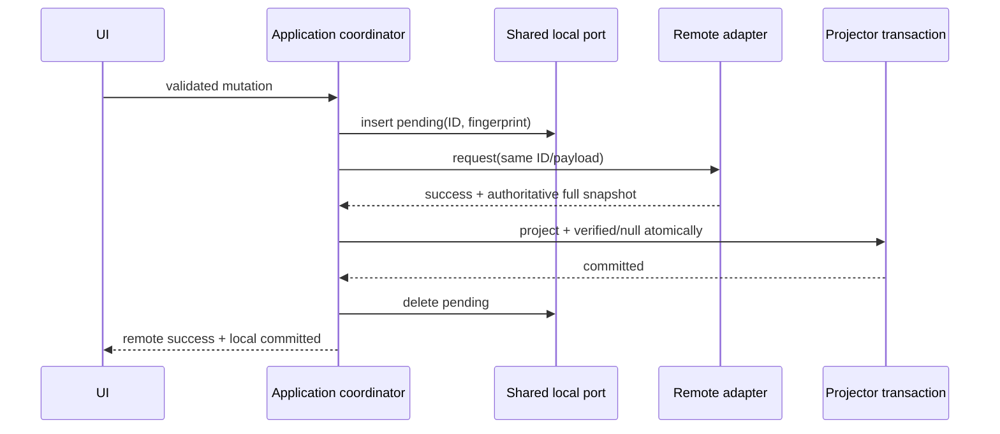
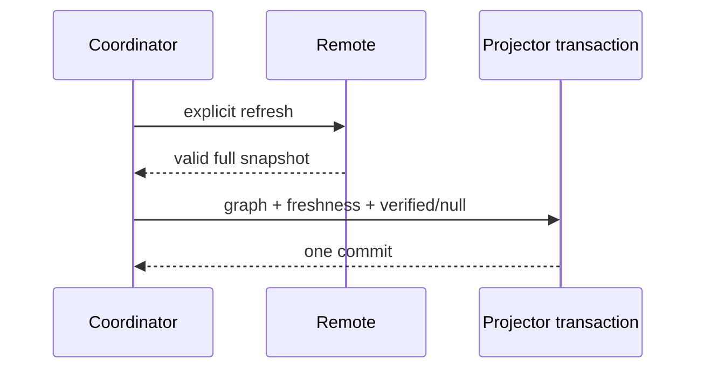
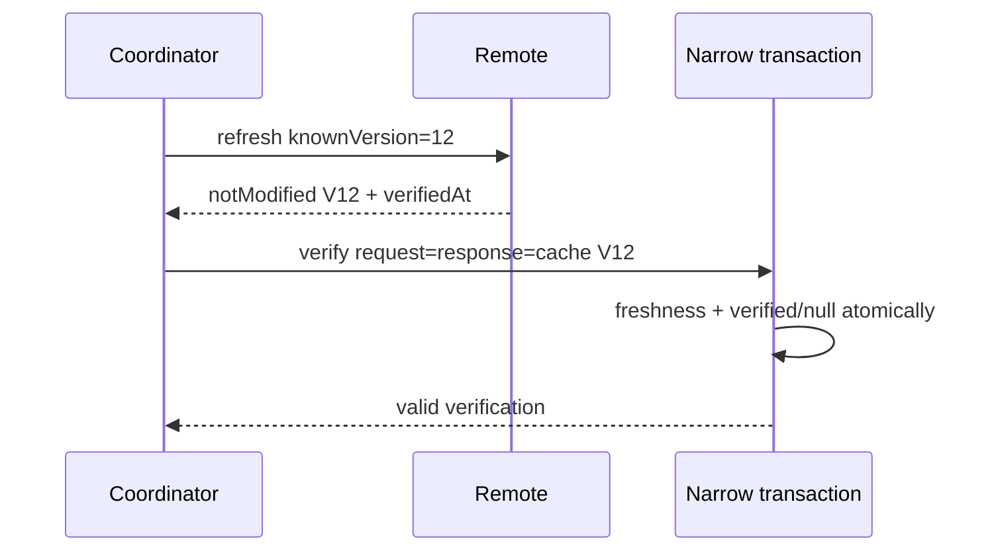

# Shared Pack Runtime Coordination Design v1

## 1. Document Status

- Status: **Phase 1d COMPLETE — documentation-only technical design gate**.
- Repository baseline: branch `ver-1.3.2`, starting HEAD `67d4a62d78a4e4a4aaa9aaf8999dec933dd22c16`, inspected on 2026-08-05.
- Starting working tree: clean; no pre-existing user changes were present.
- Runtime status: unchanged. This phase adds no Dart type, production directory, dependency, table, DAO, migration, route, provider, UI, generated file, or executable test.
- Planned local schema remains `driftSchemaVersion = 6`; production remains at version 5 until the authorized implementation phase.
- The locked Phase 1b schema is sufficient for the marker-only restart policy selected here. No Phase 1b schema revision is required.
- This document does not begin Phase 2 runtime implementation and does not lock formal `SharedPackApplicationService` signatures.

Decision vocabulary:

- **Locked**: later design and implementation MUST preserve the decision unless the owning upstream specification is deliberately revised first.
- **Deferred**: the named later phase owns only the concrete expression, not the runtime invariant decided here.
- **Evidence**: a local repository observation, not a claim that planned Shared Pack behavior exists.

## 2. Purpose and Scope

This document closes the Shared Pack v1 client runtime-coordination gate. It locks:

- application ownership of coordination;
- exact per-Pack serialization and pre-Pack logical-intent coordination;
- lock lifetime, cancellation, registry cleanup, and cross-Pack concurrency;
- defense in depth between process-local serialization and the Phase 1c database guard;
- persisted trust transitions and stable failure reasons;
- mutation gating and atomic trust composition;
- `clientRequestId`, logical payload fingerprint, and pending-mutation lifecycles;
- app-restart and unknown-outcome behavior for every v1 mutation;
- user-triggered retry/recovery sequencing, remote-result classification, diagnostics, and Phase 2f test obligations.

This is a semantic design. Formal Dart methods, result types, ports, Riverpod state, routes, UI controls, and Fake Remote signatures remain Phase 1f work.

## 3. Source Authority

The following were fully read and cross-checked:

- `README.md`;
- `docs/core/04_core_model_spec_v1.md`;
- `docs/core/05_home_widget_spec.md`;
- `docs/core/06_shared_pack_direction_spec_v1.md`;
- `docs/core/07_shared_pack_remote_contract_v1.md`;
- `docs/core/08_shared_pack_runtime_consistency_spec_v1.md`;
- `docs/core/09_shared_pack_technical_design_v1.md`;
- `docs/core/10_shared_pack_local_cache_schema_design_v1.md`;
- `docs/core/11_shared_pack_snapshot_projector_design_v1.md`;
- `docs/ui/visual_direction.md`;
- `pubspec.yaml`;
- the app composition, router, Personal database/tables/DAO/repositories/providers, Home Widget feature, migration test, and backup service test named by this gate.

Authority order is:

1. `06` — Shared Pack v1 product scope, roles, capabilities, and exclusions;
2. `07` — remote requests/responses, DTOs, versions, idempotency transport, and snapshot contract;
3. `08` — ordering, trust, freshness, unknown outcome, retry, and failure semantics;
4. `04` — Personal/local-first model and Personal/Shared boundary;
5. `05` — Home Widget exclusion;
6. `09` — feature ownership and dependency direction;
7. `10` — locked v6 cache/pending schema and constraints;
8. `11` — validation, canonical snapshot fingerprint, transaction projector, version/owner guards, `notModified`, and projection outcomes.

Earlier documents use `lastRefreshedAt` and `accessState` as early contract language. The later Gate-approved schema locks `last_verified_at` and `trust_state`; this document preserves their upstream semantics without modifying the earlier sources. Invite-only operations remain outside the projector and active Pack versioning.

## 4. Current Repository Evidence

### 4.1 Starting Git evidence

```text
branch: ver-1.3.2
HEAD: 67d4a62d78a4e4a4aaa9aaf8999dec933dd22c16
starting working tree: clean
recent history:
67d4a62 define Shared Pack snapshot projector design
cf6812c clarify Shared Pack cache schema boundaries
36291a7 define Shared Pack local cache schema design
ffc4bdc docs: define Shared Pack Phase 1a architecture boundary
e870540 define Shared Pack runtime consistency contract
339bc1c docs: close Shared Pack Phase 0.5 contracts
d110915 docs: lock Shared Pack v1 product boundary
ebbb820 Update 06_shared_pack_direction_spec_v1.md
```

The target Phase 1d document did not exist. The local Phase 1c artifact is complete and records `Phase 1c COMPLETE — documentation-only technical design gate`. Baseline commits inside older documents are historical evidence, not this phase's HEAD.

### 4.2 Production evidence

- `AppDatabase.schemaVersion` is 5 and registers only Personal tables plus `ReminderDao`.
- `tables.dart` and `ReminderDao` remain Personal/local-first; no Shared table or DAO exists.
- `ReminderDao.exportBackupData`, `replaceUserDataFromBackup`, and `_clearUserData` use explicit Personal collections/table lists.
- `ItemRepository`, `HomeRepository`, and all reminder providers compose Personal repositories and models only.
- `AppBootstrap` initializes the existing Personal notification/badge and Home Widget flows. It has no Shared identity, pending scan, refresh, or recovery work.
- `lib/app/router.dart` registers no Shared route.
- Home Widget reads `HomeAttentionSource`/`HomeRepository` and mutates only through Personal `ItemRepository`.
- `test/migration_test.dart` is a fresh version-5 smoke test, not a v5-to-v6 migration test. `test/backup_service_test.dart` covers the Personal backup/import/reset boundary only.
- `pubspec.yaml` has no Supabase or cryptographic dependency.
- The required search found no production `SharedPack`, Shared cache, remote version, trust, `clientRequestId`, pending mutation, mutex, `notModified`, or Supabase implementation in `lib`, `test`, `android`, `ios`, or `pubspec.yaml`; matches are documentation-only.

All future component names below are design targets, not claims about existing production code.

## 5. Locked Inputs from Phases 1a–1c

- Shared Pack is remote-authoritative; local Shared cache is a readable projection.
- All Shared mutations cross the Shared application boundary.
- Every snapshot-changing success returns a full authoritative active snapshot; a mutation fragment is never cache truth.
- Invite state is not in the active snapshot, does not change `packVersion`, and never enters the projector.
- Local v6 capacity is exactly `shared_pack_cache`, `shared_membership_cache`, `shared_item_cache`, and minimal `shared_pending_mutation`.
- Persisted trust values are exactly `verified`, `needsRevalidation`, and `inaccessible`.
- Freshness is `last_verified_at`.
- Item identity is always `(remotePackId, remoteItemId)`.
- Phase 1c's transaction rereads root/version/fingerprint/owner and is the final cache-truth guard.
- Older snapshots and stale/missing-cache `notModified` are no-write outcomes, not current-cache verification.
- A valid exact `notModified` requires request, response, and current-cache versions to match.
- Personal reset preserves Shared cache, trust, and pending intent.
- General Personal startup, Home, Widget, notifications, backup, and Personal repositories remain outside Shared coordination.

## 6. Runtime Coordination Goals

The runtime MUST:

1. serialize all same-Pack Shared work that can affect or verify Pack state;
2. allow different Packs to progress independently;
3. give one logical mutation one durable ID and one semantic payload fingerprint;
4. persist an unresolved intent before the first possible remote side effect;
5. keep unknown outcomes visible and fail closed across cancellation/restart;
6. compose graph/freshness acceptance and trust recovery atomically;
7. never let process-local ordering replace database truth guards;
8. distinguish remote outcome, local projection outcome, trust outcome, and pending-intent outcome;
9. recover only through same-ID replay and existing `getSharedPackSnapshot` evidence;
10. require no remote call, identity initialization, discovery, or recovery work for normal Personal startup.

## 7. Explicit Non-goals

This phase does not design or implement background sync, realtime, periodic refresh, automatic retry, offline outbox, worker leases, membership discovery, `listMySharedPacks`, account binding, device recovery, UI wording, formal APIs, or production mutex/DAO/remote/projector code.

It also does not add fixed Shared Items, Pack timezone, recurrence, skip, defer, undo, history, archived browsing/restore, Personal promotion, Home aggregation, Widget, notification, Shared backup/restore, leave/removal/transfer, multiple invite codes, or Personal reset as Shared unlink/recovery.

## 8. Runtime Coordinator Ownership

**Locked owner:** future `lib/features/shared_packs/application/`.

Responsibilities:

- establish and retain logical mutation intent;
- create/own `clientRequestId` and payload fingerprint;
- perform local preflight, trust/role/version/pending gating, pending lifecycle, dispatch classification, projection/trust composition, and recovery sequencing;
- own exact Pack lanes, pre-Pack single-flight entries, duplicate-tap coalescing, cancellation semantics, and effective fail-closed state;
- expose separated remote/local outcomes to future providers/UI.

Boundaries:

- Shared providers/UI request use cases and render state; they do not own locks, IDs, retry, trust, pending intent, or recovery policy.
- A concrete remote adapter transmits the supplied operation, ID, and request. It never creates a logical intent, replaces an ID, retries with a new ID, or mutates pending state.
- A concrete Shared local adapter/DAO executes the requested narrow transaction. It does not decide whether a mutation may dispatch.
- Personal repositories, `ReminderDao`, Home, Widget, notification, backup, and global app services never participate.
- Shared pending scan/recovery is not a prerequisite for `main`, `ReminderApp`, `AppBootstrap`, or Personal use. A future optional pure-local scan may run only when the Shared runtime is initialized; it may not initialize identity or call remote.

Formal application-service method signatures remain Phase 1f.

## 9. Coordination Key Model

### 9.1 Pack-scoped operations

These operations use one exclusive lane keyed by the exact, opaque `remotePackId`:

```text
updateSharedPackMetadata
createSharedItem
updateSharedItem
archiveSharedItem
getOrCreateInviteCode
rotateInviteCode
getSharedPackSnapshot
completeSharedItem
```

The key is exact string equality. It is not lowercased, normalized, hashed as identity, or replaced by local ID/display name.

Within a Pack, mutation, manual refresh, and same-ID replay enter a FIFO admission queue. A duplicate invocation for the already in-flight logical intent attaches to its existing future/outcome instead of creating another queue node. Different Packs use different lanes and may run concurrently.

### 9.2 Pre-Pack/unknown-Pack operations

```text
createSharedPack
joinSharedPack
previewInviteCode
```

- `createSharedPack` and `joinSharedPack` have no reliable Pack ID before success. Their mutation coordination key is `(operationName, clientRequestId)` after the application accepts the logical intent.
- Before ID creation, an application-owned ephemeral submission token coalesces repeated callbacks from the same active submit gesture. It is not persisted and is not an idempotency key.
- `previewInviteCode` is a read. Same-process identical previews may be coalesced by an in-memory key derived from the canonical invite code, but it creates no pending row and no mutation intent.
- Unrelated create/join intents may run concurrently. One unresolved create blocks a new create intent that could duplicate the same user action; one unresolved join blocks a new join intent until the original is resolved or exact same-ID replay is possible.
- `listMySharedPacks`, remote membership discovery, display-name lookup, and request-order inference are forbidden coordination substitutes.

When create/join success returns a Pack ID:

1. validate/decode the success envelope;
2. update the existing pending row's nullable `target_remote_pack_id` in a narrow local write when possible;
3. acquire the exact Pack lane;
4. run the normal projector/trust composition;
5. resolve pending only after the required local commit/classification.

The pre-Pack single-flight entry remains alive while waiting for the Pack lane, but it owns no Pack lock. The handoff never bypasses or weakens the projector's transaction guard.

If the target update fails, the coordinator retains the returned Pack ID in the live intent and still attempts the guarded Pack projection; a successful projection/trust commit may then resolve the row. If projection also fails, the null-target row remains a safe marker and same-process recovery may use the in-memory Pack ID, but a later restart gets no invented ID or discovery path. The application reports this as local handling failure, not remote failure.

## 10. Per-Pack Serialization Contract

One admitted Pack operation exclusively owns the lane across:

```text
local preflight
→ trust/role/version/pending gating
→ pending-row insert or same-intent validation
→ remote call
→ response/transport classification
→ projector or notModified/invite-result handling
→ atomic trust composition or failure marking
→ pending resolution decision
→ publish application outcome
```

Refresh and invite preview do not create pending rows. Invite mutations do create them and use the same Pack lane even though they do not enter snapshot projection.

FIFO is a process-local predictability rule, not authoritative version order. A queue node canceled before dispatch may be removed. Same-ID replay enters the same lane; it never jumps around an in-flight mutation. No coordinator operation may acquire a second Pack lane.

## 11. Defense in Depth: Lane plus Database Guard

Locked invariant:

```text
application per-Pack serialization
+
projector transaction root/version/fingerprint/owner guard
```

- The lane is process-local coordination for one application runtime.
- The database transaction guard is the final cache-truth defense.
- App restart, another isolate, incorrect lane use, late responses, or future multi-process behavior can lose/avoid the process lock but cannot bypass the database reread.
- Request issue order and response arrival order are never authoritative.
- Authoritative `packVersion` and same-version fingerprint determine acceptance.
- A lower-version response inside a correctly held lane still yields the Phase 1c no-write outcome.
- Application code does not reproduce the Phase 1c comparison/projector algorithm. It consumes its semantic outcome and applies coordination/trust policy.

## 12. Lock Lifetime, Cancellation, and Registry Cleanup

### 12.1 Cancellation

| Point | Mutation meaning | Required behavior |
| --- | --- | --- |
| Before pending insert | No dispatch possible | Remove queued work; no pending row; no remote effect |
| After pending insert but before dispatch | Confirmed no dispatch | Delete pending row before outcome completes; ID is terminated, not reused for a different intent |
| Remote adapter confirms dispatch did not occur | Confirmed no side effect | Delete pending; trust unchanged |
| At/after possible dispatch | Outcome may be unknown | Caller cancellation only detaches UI; retain pending; continue classification best-effort while process lives |
| Response received, local handling active | Remote outcome known | Do not abandon projector/trust/pending sequence because the caller left |
| Process killed | In-memory lock disappears | Pending and DB guards preserve safety; restart policy applies |

A read refresh canceled after dispatch may finish and apply guarded verification, or discard its response before local handling. It has no pending mutation. Mutation cancellation can never assert remote failure after possible dispatch.

### 12.2 Deadlock and retention prevention

- No nested Pack lock acquisition.
- Public coordinator entrypoints never call another public Pack-scoped entrypoint while holding a lane. Internal helpers receive an already-owned-lane context.
- Create/join handoff acquires only the returned Pack lane; it holds no other Pack lane.
- A registry entry tracks current owner plus queued waiters. Remove it only when owner is released, queue is empty, and no single-flight intent references it.
- Removal is compare-by-entry-identity so an old releaser cannot remove a newly created lane for the same Pack.
- Cancellation removes only its queue node and decrements registry ownership exactly once.
- Registry entries have no TTL and are not retained after becoming idle; pending rows, not mutex objects, carry restart evidence.

## 13. Database Guard and Atomic Trust Composition

### 13.1 Successful full snapshots

For initial, accepted newer, or verified identical same-version snapshots, graph/freshness handling and the success trust transition are one local transaction:

```text
accepted graph/freshness operation
+ trust_state = verified
+ trust_failure_reason = null
→ one commit
```

This is composition around the Phase 1c transaction, not a second implementation of version/fingerprint/owner rules. Initial root insertion already uses `verified/null`. For an existing root, the local port/projector transaction must accept the Phase 1d trust-success update as part of the same commit.

No caller can observe a newly committed graph while the root remains in an older known-untrusted state. If projection or commit rolls back, `verified` also rolls back.

### 13.2 Valid `notModified`

The exact-match narrow operation atomically performs:

```text
last_verified_at = max(current, verifiedAt)
trust_state = verified
trust_failure_reason = null
```

It still rewrites no metadata, version, fingerprint, membership, or Item row.

### 13.3 Failure/inaccessibility writes

- After projection/validation/commit failure, an existing root is marked `needsRevalidation` in a separate narrow transaction before the application outcome completes.
- If that narrow mark itself fails, the coordinator keeps an in-memory mutation block; a retained known-Pack pending row supplies restart fail-closed evidence. The failure is reported as local handling failure, never as remote failure.
- `permissionDenied`/`packNotFound` update only trust fields to `inaccessible` and retain the last-known graph.
- No root is invented merely to store trust. With no root, pending/diagnostic outcome is the only local evidence.
- `shared_pending_mutation` is outside the projector transaction. A snapshot-changing success cannot delete pending before graph/trust commit.

## 14. Trust-State Machine

Time-based staleness and trust are orthogonal:

```text
temporally stale != known untrusted
```

An old `last_verified_at` does not automatically change `verified` to `needsRevalidation`.

| Current/root state | Evidence/event | Next persisted state | Reason | Cache write/action |
| --- | --- | --- | --- | --- |
| No root | Initial full snapshot commits | `verified` | `null` | Create complete graph atomically |
| `verified` | Accepted newer full snapshot commits | `verified` | `null` | Graph + freshness + trust one commit |
| `verified` | Identical same-version snapshot | `verified` | `null` | Freshness/trust narrow part of guarded transaction |
| `needsRevalidation` | Accepted full snapshot commits | `verified` | `null` | Atomic recovery with graph |
| `needsRevalidation` | Valid exact `notModified` | `verified` | `null` | Atomic freshness/trust recovery |
| `inaccessible` | Explicit known-Pack full refresh succeeds | `verified` | `null` | Retained graph reconciled atomically |
| `inaccessible` | Explicit exact `notModified` proves restored access/current version | `verified` | `null` | Narrow atomic recovery |
| Any existing root | Sent snapshot-changing mutation outcome is ambiguous | `needsRevalidation` | `remoteOutcomeUnknown` | Keep graph/pending; block new mutation |
| Any existing root | Remote success + local graph write/commit failure | `needsRevalidation` | `projectionFailed` | Roll back graph; keep pending |
| Any existing root | Snapshot semantic validation fails | `needsRevalidation` | `snapshotValidationFailed` | No graph/freshness write |
| Any existing root | Unsupported snapshot schema | `needsRevalidation` | `unsupportedSnapshotSchema` | No graph/freshness write |
| Any existing root | Same version/different content | `needsRevalidation` | `sameVersionContentConflict` | Phase 1c no-write |
| Any existing root | Owner continuity or other snapshot integrity guard fails | `needsRevalidation` | `snapshotIntegrityFailed` | No graph/freshness write |
| Any existing root | Mutation returns `staleVersion`, or item-state error proves the base obsolete | `needsRevalidation` | `staleMutationBase` | No remote side effect; explicit refresh allowed |
| Any existing root | `permissionDenied` | `inaccessible` | `permissionDenied` | Retain graph; block actions |
| Any existing root | `packNotFound` | `inaccessible` | `packNotFound` | Retain graph; block actions |
| Any | Confirmed validation/rate-limit/business failure with no evidence cache is wrong | unchanged | unchanged | Pending resolved; no trust degradation |
| Any | Local validation or identity unavailable before dispatch | unchanged | unchanged | No remote side effect |
| Any | Older full snapshot | unchanged | unchanged | No write; not recovery evidence |
| Any | Stale/missing/invalid `notModified` | unchanged | unchanged | No write; not recovery evidence |
| Any | Confirmed remote unavailable before dispatch | unchanged | unchanged | Pending deleted if inserted |
| `verified` | Only `last_verified_at` is old | `verified` | `null` | UI may show temporal staleness; mutation policy otherwise unchanged |
| Any | Invite-only ambiguous outcome | unchanged | unchanged | Active snapshot trust unchanged; pending gate remains |

No-root failures create no fake root. A later successful initial projection establishes `verified/null`.

## 15. `trust_failure_reason` Vocabulary

The exact v1 codes are:

| Code | Set when | Cleared when |
| --- | --- | --- |
| `remoteOutcomeUnknown` | Snapshot-changing mutation may have dispatched but no authoritative result is known | Accepted full snapshot or valid exact `notModified`; pending may still require separate proof |
| `projectionFailed` | Remote success is known, but local graph write/transaction/commit fails | Accepted full snapshot or valid exact `notModified` |
| `snapshotValidationFailed` | Full snapshot or verification response violates supported semantic contract | Accepted full snapshot or valid exact `notModified` |
| `unsupportedSnapshotSchema` | Full snapshot schema is unsupported | Accepted supported full snapshot or valid exact `notModified` for the retained supported cache |
| `sameVersionContentConflict` | Equal Pack version has a different Phase 1c snapshot fingerprint | Accepted newer/identical full snapshot or valid exact `notModified` |
| `snapshotIntegrityFailed` | Owner continuity/root integrity guard fails | Accepted full snapshot or valid exact `notModified` |
| `staleMutationBase` | `staleVersion`, `itemNotFound`, or `itemArchived` proves the attempted cached base is obsolete | Accepted full snapshot or valid exact `notModified` |
| `permissionDenied` | Remote explicitly denies known-Pack access | Explicit known-Pack refresh/recheck succeeds |
| `packNotFound` | Remote explicitly reports Pack missing | Explicit known-Pack refresh/recheck succeeds |

Rules:

- Codes are exact camelCase machine values, 1–64 characters.
- `verified` always has reason `null`.
- The latest known failure family may replace an earlier reason while remaining fail closed.
- Raw exception text, HTTP/server message, response body, stack trace, exception class, and user-facing text never enter the field.
- Ordinary rate limiting, local form validation, identity failure before dispatch, or confirmed pre-dispatch unavailability does not become an integrity reason.
- `remoteUnavailable` becomes `remoteOutcomeUnknown` only when dispatch may have occurred; it is not assumed remote success.

## 16. Mutation Gating Matrix

| Cache/intent state | Refresh | Mutation | Invite preview | Same-intent replay | New intent |
| --- | --- | --- | --- | --- | --- |
| `verified`, no pending | Allowed | Allowed by role/version | Allowed | n/a | Allowed |
| `verified`, unresolved known-Pack pending | Allowed | Blocked | Allowed | Allowed only with same operation/ID/exact fingerprint | Blocked for that Pack |
| `needsRevalidation` | Explicit known-Pack refresh allowed | Blocked | Allowed | Allowed only as explicit recovery with exact payload and remote-retention safety | Blocked |
| `inaccessible` | Explicit known-Pack access recheck allowed | Blocked | Allowed | Generally blocked; only a contract-authorized same-ID terminal replay may be attempted | Blocked |
| No root, unresolved create/join | No Pack refresh until Pack ID is known | Only original same-intent path | Preview remains a read | Exact re-entry may replay original ID | Duplicate create/join intent blocked |
| Matching ID, different fingerprint | Allowed if otherwise known Pack | No dispatch | Allowed | Local fail closed before remote | Blocked until original resolves |
| Temporally stale but `verified`, no pending | Manual refresh allowed | Allowed by role/version; UI may encourage refresh | Allowed | n/a | Allowed |

Additional rules:

- Role and expected versions are checked during preflight, but remote revalidates them.
- Refresh and preview create no pending row.
- A pending invite mutation blocks new Pack mutation intents even though it does not degrade active-snapshot trust; same-ID invite replay is the resolution path.
- An unresolved pending intent is never silently replaced by a new `clientRequestId`.

## 17. `clientRequestId` Lifecycle

1. A logical intent is established when the application accepts one validated user submission for a specific mutation, before remote dispatch.
2. The application/runtime layer owns the ID. UI, provider, transport, retry callback, and rebuild do not.
3. Local validation and identity acquisition occur first. Once they succeed, create a collision-resistant ID and its semantic fingerprint.
4. Insert pending before the first call that may cause a remote side effect. Insert failure forbids dispatch.
5. Duplicate taps in the same active submit context attach to the existing intent/future.
6. Timeout, temporary loss, response-decode failure after dispatch, projection failure, post-dispatch cancellation, app kill, restart, and idempotency replay retain the ID.
7. Retry of the same intent supplies the same operation, ID, semantic fields, and fingerprint. A local mismatch fails before transport.
8. The ID terminates only after a locked resolution event in Section 20. Deleting pending does not permit reusing the ID for a different payload.
9. A new ID means a genuinely new user intent only after the earlier intent is conclusively resolved.
10. App restart, elapsed time, a new UI instance, or loss of the original form is never proof of a new intent.

Future implementation requirement: use a cryptographically strong random UUID v4 in canonical lowercase 36-character form, fitting the locked 1–128 limit. Phase 1d adds no package. Random generation belongs to a Shared application-owned ID generator abstraction; secure randomness is mandatory even if the chosen Dart/platform implementation needs no new dependency.

## 18. Logical Payload Fingerprint Contract

### 18.1 Purpose and distinction

`payload_fingerprint` identifies one logical mutation payload for local same-intent validation. It is not the Phase 1c snapshot fingerprint, is not a credential, cannot reconstruct a request, and is not user-facing.

The operation name is stored separately and excluded from the fingerprint bytes. `clientRequestId` is never part of semantic payload. The pair `(operation_name, client_request_id)` selects the pending row; the fingerprint proves payload equality.

### 18.2 SPMF-1 canonical profile

The locked profile is **Shared Pack Mutation Fingerprint profile 1 (`SPMF-1`)**:

1. Build the exact per-operation semantic object in Section 19, emitting keys in the listed order.
2. Emit nullable fields as a key with either JSON `null` or a string; never omit them.
3. Emit an optional field as an explicit presence object, e.g. `"clientOccurredAt":{"present":false}` or `{"present":true,"epochMs":...}`.
4. Serialize with the Phase 1c SPCS-1 scalar/string/integer/JSON rules: no whitespace, exact fixed key order, exact integers, direct UTF-8 Unicode scalars, no normalization, and deterministic escaping.
5. `canonicalBytes = UTF8("SPMF-1\n" + canonicalJson)`.
6. `payloadFingerprint = lowercaseHex(SHA-256(canonicalBytes))`, exactly 64 lowercase hex characters.

### 18.3 Semantic normalization

- Exact remote IDs are included and never normalized.
- Every expected Pack/Item version used by the request is included.
- Null, empty string, and optional absence remain distinct.
- General user-entered title/description/icon strings are not arbitrarily trimmed, case-folded, or Unicode-normalized. The fingerprint uses the exact validated outgoing value.
- Owner/member display names use the contract-canonical trimmed outgoing value because `06`/`07` explicitly require trimming. They are not otherwise normalized.
- Invite input alone uses the authorized invite canonicalization: remove allowed ASCII spaces/hyphens, uppercase ASCII letters, validate the six-character allowed alphabet, and fingerprint that canonical code. Server repeats normalization atomically.
- Timestamps become exact UTC epoch milliseconds under the Phase 1c rules.
- Map iteration order, DTO serializer formatting, device timezone, request time, and runtime object hashes never participate.
- Invite canonical code and raw request payload never appear in general logs.

Phase 1e must make remote idempotency payload equality compatible with these same semantic fields and distinctions. If the server uses a different internal digest, it must still implement equivalent equality. Same ID plus different local fingerprint is rejected before a remote call.

## 19. Per-Operation Payload Field Matrix

The listed order is the SPMF-1 object-key order.

| Operation | Included semantic fields |
| --- | --- |
| `createSharedPack` | `title`, `description` (string/null), `iconEmoji`, canonical `ownerDisplayName` |
| `updateSharedPackMetadata` | exact `remotePackId`, `expectedPackVersion`, `title`, `description` (string/null), `iconEmoji` |
| `createSharedItem` | exact `remotePackId`, `expectedPackVersion`, `title`, `description` (string/null), `initialStateAnchorDateEpochMs`, `infoAfterMinutes`, `warningAfterMinutes`, `dangerAfterMinutes` |
| `updateSharedItem` | exact `remotePackId`, exact `remoteItemId`, `expectedItemVersion`, `title`, `description` (string/null), `infoAfterMinutes`, `warningAfterMinutes`, `dangerAfterMinutes` |
| `archiveSharedItem` | exact `remotePackId`, exact `remoteItemId`, `expectedItemVersion` |
| `getOrCreateInviteCode` | exact `remotePackId` |
| `rotateInviteCode` | exact `remotePackId` |
| `joinSharedPack` | canonical invite code, canonical `memberDisplayName` |
| `completeSharedItem` | exact `remotePackId`, exact `remoteItemId`, `expectedItemVersion`, explicit `clientOccurredAt` presence/value |

`createSharedItem` has implied v1 `type = stateBased`; operation contract supplies it and no request type field exists. The baseline v1 coordinator sends `completeSharedItem.clientOccurredAt` absent. If Phase 1f/implementation elects to send it, the exact value participates and restart replay is marker-only unless an independent source preserves that value.

## 20. Pending Mutation Lifecycle

### 20.1 Creation

- Complete local validation and required lazy identity acquisition before creating a pending row.
- Create the application intent/ID/fingerprint, then insert pending before the first possibly side-effecting dispatch.
- A validation failure creates no row. If a row was created but cancellation/transport proves no dispatch, delete it safely.
- Insert failure prevents remote dispatch.
- Row and in-memory intent fingerprints must match exactly.
- Fill `target_remote_pack_id` for known-Pack operations; leave it null for create/join until a success response supplies the Pack ID.
- Never fabricate a Pack root to satisfy pending storage.

### 20.2 While unresolved

- Retain on timeout/lost response after possible dispatch, app kill, response-decode failure, remote-success/local-projection failure, and idempotency conflict.
- Retry only with same operation/ID/fingerprint and exact semantic payload.
- Pending is evidence and a gate, not an executable queue. Transport never scans it to send work.
- `status` remains the single locked value `awaitingResolution`; resolution deletes the row rather than inventing lifecycle states.
- A pure-local Shared-runtime scan may update an existing known root to `needsRevalidation/remoteOutcomeUnknown` for a snapshot-changing pending intent. It creates no root and makes no remote call.

### 20.3 Resolution/deletion rules

| Event | Delete pending? | Required ordering/proof |
| --- | --- | --- |
| Confirmed cancellation before dispatch | Yes | Transport dispatch impossible |
| Confirmed pre-dispatch transport/identity failure | Yes if row exists | No remote side effect possible |
| Confirmed remote validation/rate-limit/business failure with no side effect | Yes | Response is terminal; apply stale/inaccessible trust policy where relevant |
| `staleVersion`/item stale-base error | Yes | No side effect; first persist `needsRevalidation/staleMutationBase` if root exists |
| `permissionDenied`/`packNotFound` | Yes | First persist inaccessible trust if root exists |
| Snapshot-changing success | Yes | Only after full projector + success trust composition commits, or after a known older-snapshot response proves the current cache is already newer and remote success is classified |
| Successful same-ID idempotency replay | Yes | Same handling as original authoritative response |
| Invite-only success/replay | Yes | After authoritative invite result is decoded/handled; no projector |
| Remote success + validation/projection failure | No | Retain through recovery |
| Ambiguous timeout/decode/cancellation after dispatch | No | Outcome unknown |
| Local fingerprint mismatch | No | Do not dispatch; original remains unresolved |
| Remote `idempotencyConflict` | No | This attempt had no effect, but same-key prior payload/outcome is not proven; fail closed |
| Authoritative refresh | Only with operation-specific proof below | Refresh success alone is never universal proof |
| App restart | No | Restart changes no remote fact |

Operation-specific refresh proof when the exact original semantic payload is available and fingerprint-matched:

- `updateSharedPackMetadata`: current version is greater than the original expected version and all intended metadata fields exactly match; resolve as effect-satisfied, without claiming execution attribution.
- `updateSharedItem`: current Item version is greater than expected and all intended definition fields exactly match; resolve as effect-satisfied.
- `archiveSharedItem`: the target Item is absent from an accepted active snapshot; resolve as terminal effect-satisfied.
- `createSharedItem`, `completeSharedItem`, create/join, and invite mutations: snapshot cannot prove the original intent; retain until same-ID authoritative replay/response.

No local automatic TTL exists. Delete only on explicit resolution. Personal reset and app restart preserve rows. OS app-data clear/uninstall may remove them with all other local state.

An `inaccessible` transition caused by a refresh never deletes an older unrelated unknown-outcome row. A terminal permission/not-found response deletes only the pending row for that conclusively rejected request; the retained root/trust reason remains the fail-closed evidence.

Phase 1e must choose remote idempotency retention that does not make a still-valid client replay silently execute again. If remote retention expires before a local unresolved marker, the client may neither treat the old ID as safe nor switch automatically to a new ID. The marker remains fail closed and requires a future explicit product/support contract; Phase 1d does not invent one.

## 21. App Restart and Unknown-Outcome Policy

The selected v6 policy is **durable marker, never automatic replay**.

- General app startup makes no Shared remote call and need not initialize Shared identity/runtime.
- If a future composition performs a startup scan, it is pure-local, non-blocking for Personal startup, and never sends/retries/refreshes.
- On Shared runtime/flow load, known-Pack pending makes that Pack effectively fail closed for new mutation. Snapshot-changing pending also establishes/keeps `needsRevalidation`; invite-only pending leaves snapshot trust unchanged but still blocks new intent.
- Unknown-Pack pending blocks replacement create/join intent. It cannot use hidden discovery.
- Fingerprint cannot reconstruct the payload. Explicit same-ID replay is available only after the application reconstructs every semantic field from independent state or user re-entry and verifies the fingerprint.
- App restart itself never generates a new ID.

## 22. Per-Operation Restart Classification

`Auto` is **No** for every operation.

| Operation | User same-ID replay after restart | Exact request source | Fingerprint-only capability | Target Pack | Snapshot recovery/proof | New intent rule |
| --- | --- | --- | --- | --- | --- | --- |
| `createSharedPack` | Only after exact title/description/icon/owner-name re-entry matches | User re-entry or independently retained draft (not pending table) | Duplicate marker only | Null unless success response was seen and target updated | No discovery; if target became known, refresh may recover cache but does not prove create intent without response | Block new create until same-ID result/terminal proof |
| `updateSharedPackMetadata` | Exact re-entry plus original expected version from retained old cache/draft | Old cache + re-entered desired values | Marker/equality check | Known | Refresh allowed; exact state/version proof may resolve | New ID only after resolution |
| `createSharedItem` | Exact re-entry including anchor/thresholds and original Pack version | Old cache + user/draft | Marker/equality check | Known | Refresh allowed but cannot prove which create intent made an Item | Keep marker until same-ID result |
| `updateSharedItem` | Exact re-entry plus old Item version | Old cache + user/draft | Marker/equality check | Known | Exact definition + advanced version may resolve effect-satisfied | New ID only after resolution |
| `archiveSharedItem` | Usually reconstructable from retained old Item identity/version | Old cache/selected target | Marker/equality check | Known | Accepted absence proves terminal archive effect | New ID only after resolution |
| `getOrCreateInviteCode` | Yes; payload is exact Pack ID | Pending target/Shared Pack context | Marker/equality check | Known | Active snapshot cannot prove invite state | Same-ID response required |
| `rotateInviteCode` | Yes; payload is exact Pack ID | Pending target/Shared Pack context | Marker/equality check | Known | Active snapshot cannot prove rotation | Same-ID response required |
| `joinSharedPack` | Only after exact canonical invite and member-name re-entry matches | User re-entry/independent draft | Duplicate marker only | Null unless success response updated it | No discovery while null; known target may refresh cache but lost success still needs same-ID proof | Block new join until resolution |
| `completeSharedItem` | Baseline request (no `clientOccurredAt`) may reconstruct from retained old Item ID/version and explicit user confirmation | Old cache + user confirmation; otherwise independent draft | Marker/equality check | Known | Snapshot cannot attribute current completion to this request | Same-ID result required |

If refresh advances/removes the old cache fields needed to recreate a request, the fingerprint still prevents an unsafe replay but cannot recover the lost fields. The row remains marker-only.

## 23. Retry and Recovery Sequencing

### 23.1 Same-process timeout retry

```text
existing logical intent
→ same operation / clientRequestId / semantic payload / fingerprint
→ enter exact Pack or intent lane
→ validate pending match
→ explicit remote idempotency replay
→ authoritative result
→ projector or invite-result handling
→ atomic trust composition
→ pending resolution
```

### 23.2 Known-Pack unknown outcome

```text
pending retained
→ snapshot-changing intent makes Pack needsRevalidation
→ all new mutation blocked
→ user explicitly chooses same-intent replay and/or getSharedPackSnapshot
→ authoritative guarded evidence
→ atomic trust recovery
→ pending deleted only by operation-specific proof
```

### 23.3 Remote success + projection failure

```text
remote success remains a distinct outcome
→ pending retained
→ needsRevalidation/projectionFailed
→ no new mutation
→ explicit getSharedPackSnapshot
→ accepted full snapshot or exact notModified
→ verified/null atomically
→ pending resolved only by operation-specific proof or same-ID result
```

### 23.4 Permission lost

```text
permissionDenied or packNotFound
→ retain root/children
→ inaccessible with exact reason
→ delete terminal request pending
→ block mutation
→ no discovery
→ explicit known-Pack refresh may recheck access
```

### 23.5 Unknown-Pack create/join

With null target, no stored body, and no discovery, the only safe paths are:

1. exact user/draft reconstruction → fingerprint match → explicit same-ID replay; or
2. if an earlier decoded success supplied a target, enter that Pack lane and use normal projection/refresh; or
3. retain the unresolved marker.

There is no automatic retry, new ID, background work, membership listing, or assertion that remote failed.

## 24. Remote Result Classification Matrix

Abbreviations: `U` unknown, `N` no side effect, `Y` side effect/success known; “blocked” includes pending and trust gates.

| Result | Effect | Pending | Trust | Cache/projector | Block/new intent | Next action / ID |
| --- | --- | --- | --- | --- | --- | --- |
| Local validation failure | N | Do not create | unchanged | none | New corrected intent allowed | New ID only when user resubmits corrected intent |
| Identity unavailable before dispatch | N | Do not create/delete if inserted | unchanged | none | Existing cache unchanged | Retry identity flow; original undispatched ID is terminated |
| Confirmed pre-dispatch transport failure | N | Delete | unchanged | none | Unblocked if no other gate | User may start a new intent; do not reuse terminated ID for different payload |
| Ambiguous timeout after dispatch | U | Retain | snapshot mutation → `needsRevalidation/remoteOutcomeUnknown`; invite unchanged | none | New mutation blocked | Same-ID replay and/or known-Pack refresh |
| Confirmed validation/rate-limit/business failure | N | Delete | unchanged unless stale-base family | none | New corrected intent allowed if trust permits | Old ID terminated |
| `staleVersion` | N | Delete after trust mark | `needsRevalidation/staleMutationBase` | no projection | Blocked | Explicit refresh, then genuinely new intent |
| `idempotencyConflict` | Prior key outcome uncertain | Retain | snapshot mutation → `needsRevalidation/remoteOutcomeUnknown`; invite unchanged | none | Blocked | No payload switch; investigate/recover original key |
| `permissionDenied` | N for attempt | Delete after trust mark | `inaccessible/permissionDenied` | retain graph | Blocked | Explicit access recheck; old ID not reused |
| `packNotFound` | N for attempt | Delete after trust mark | `inaccessible/packNotFound` | retain graph | Blocked | Explicit access recheck only |
| Success + valid initial/newer/identical full snapshot | Y | Delete after commit | `verified/null` atomically | Project/verify | Unblocked absent another pending | ID resolved; later user action gets new ID |
| Success + invalid/unsupported snapshot | Y | Retain | needs + matching reason | no write | Blocked | Refresh/same-ID replay |
| Success + local projection/commit failure | Y | Retain | `needsRevalidation/projectionFailed` | rollback | Blocked | Explicit refresh/same-ID replay |
| Successful idempotency replay | Y/replayed | Handle as original; delete only after required handling | according to result | projector/invite handler | Unblock after resolution | Same ID was reused correctly |
| Successful invite-only mutation | Y | Delete after result handling | unchanged | no projector/version change | Unblocked | Later invite intent gets new ID |
| Older full snapshot no-write | Y if mutation envelope; N/A for refresh | Mutation pending may delete after remote success classification; refresh has none | unchanged; never recovery | Phase 1c no-write | Trust gate may remain | Do not reproject; current cache is newer |
| Same-version content conflict | Remote envelope may be Y | Retain for mutation | `needsRevalidation/sameVersionContentConflict` | no write | Blocked | Explicit refresh/same-ID evidence |
| Valid exact `notModified` | Read only | none | `verified/null` atomically | freshness only | Trust unblocked; pending may remain | No mutation ID |
| Stale/missing/invalid `notModified` | Read only | none | unchanged | no write | Existing gate remains | Full refresh/retry read |
| Confirmed `itemNotFound`/`itemArchived` against cached target | N | Delete after trust mark | `needsRevalidation/staleMutationBase` | no write | Blocked | Explicit refresh |

Refresh success never unconditionally deletes every unknown pending intent. `clientRequestId` reuse is allowed only for the exact unresolved intent; a new logical intent is allowed only after its prior marker is resolved and trust/pending gates permit it.

## 25. Sequence Diagrams

### 25.1 Pack mutation success and full projection



### 25.2 Mutation and manual refresh cross; higher version wins

```mermaid
sequenceDiagram
  participant C as Coordinator/lane
  participant R as Remote
  participant DB as Projector DB guard
  Note over C: Same-process work is serialized; an external/isolate response may still be late
  R-->>C: mutation response V8
  C->>DB: guarded project V8
  DB-->>C: commit V8
  R-->>C: refresh response V9
  C->>DB: guarded project V9
  DB-->>C: commit V9
  Note over DB: Final cache V9 regardless of arrival history
```

### 25.3 Older refresh arrives late

```mermaid
sequenceDiagram
  participant R as Late refresh
  participant C as Coordinator
  participant DB as Projector DB guard
  Note over DB: Cache already V11
  R-->>C: full snapshot V10
  C->>DB: guarded projection
  DB-->>C: ignoredOlderSnapshot; zero writes
```

### 25.4 Timeout then same-process same-ID retry

```mermaid
sequenceDiagram
  participant C as Coordinator
  participant L as Pending store
  participant R as Remote idempotency
  C->>L: insert ID X + fingerprint F
  C->>R: mutation X/F
  R--xC: response lost/timeout
  Note over C,L: retain X/F; no new ID
  C->>R: explicit retry X/F
  R-->>C: original authoritative replay
  C->>L: delete only after required local commit
```

### 25.5 App killed after dispatch; restart finds pending

```mermaid
sequenceDiagram
  participant A as App process 1
  participant L as Local pending
  participant R as Remote
  participant B as App process 2
  A->>L: persist pending before dispatch
  A->>R: mutation
  A-xA: process killed
  B->>L: pure-local Shared-runtime scan
  L-->>B: awaitingResolution
  Note over B: no startup remote call; Pack/new intent fail closed
  B->>R: user-triggered exact same-ID replay (optional)
```

### 25.6 Remote success but validation/projection fails

```mermaid
sequenceDiagram
  participant C as Coordinator
  participant R as Remote
  participant P as Projector
  participant L as Trust/pending store
  R-->>C: remote success + full snapshot
  C->>P: validate/project
  P-->>C: validation or commit failure
  C->>L: needsRevalidation + reason; retain pending
  Note over C: report remote success separately from local failure
```

### 25.7 `staleVersion` then refresh

```mermaid
sequenceDiagram
  participant C as Coordinator
  participant R as Remote
  participant L as Local
  R-->>C: staleVersion; no side effect
  C->>L: needsRevalidation/staleMutationBase; delete request pending
  Note over C: new mutation blocked
  C->>R: user-triggered getSharedPackSnapshot
  R-->>C: authoritative full snapshot
  C->>L: atomic project + verified/null
```

### 25.8 Same version/different content

```mermaid
sequenceDiagram
  participant C as Coordinator
  participant DB as Projector guard
  participant L as Trust store
  C->>DB: incoming V12/Fx; cache V12/F
  DB-->>C: sameVersionContentConflict; zero writes
  C->>L: needsRevalidation/sameVersionContentConflict
  Note over C: mutation blocked; no arbitrary winner
```

### 25.9 `needsRevalidation` recovered by full snapshot



### 25.10 `needsRevalidation` recovered by exact `notModified`



### 25.11 Permission/not-found becomes inaccessible

```mermaid
sequenceDiagram
  participant C as Coordinator
  participant R as Remote
  participant DB as Local trust
  R-->>C: permissionDenied or packNotFound
  C->>DB: inaccessible + exact reason
  Note over DB: retain root and last-known children
  Note over C: block actions; no discovery
```

### 25.12 `createSharedPack` unknown before Pack ID

```mermaid
sequenceDiagram
  participant C as Pre-Pack intent coordinator
  participant L as Pending store
  participant R as Remote
  C->>L: pending(create, ID X, target null, F)
  C->>R: create X/F
  R--xC: outcome/response lost before Pack ID
  Note over C,L: retain null-target marker; no discovery/new ID
  C->>R: only user-triggered exact X/F replay
```

### 25.13 `joinSharedPack` success response lost

```mermaid
sequenceDiagram
  participant C as Pre-Pack intent coordinator
  participant L as Pending store
  participant R as Remote
  C->>L: pending(join, ID J, target null, F)
  C->>R: join J/F
  R--xC: success response lost
  Note over C: cannot discover membership/Pack
  Note over L: retain J/F; block replacement join
  C->>R: user re-enters exact payload; replay J/F
```

### 25.14 Invite-only success and lost response

```mermaid
sequenceDiagram
  participant C as Pack lane
  participant L as Pending store
  participant R as Remote
  C->>L: persist invite intent ID/F
  C->>R: get/rotate invite
  alt response received
    R-->>C: authoritative invite result
    Note over C: no projector; no packVersion change
    C->>L: delete pending
  else response lost
    R--xC: timeout
    Note over C,L: trust unchanged; pending/new-intent gate retained
  end
```

## 26. Scenario A–H Coordination Walkthroughs

| Scenario | Phase 1d obligation |
| --- | --- |
| A Older Refresh Arrives Late | Lane cannot authorize it; DB returns older no-write. Trust and freshness unchanged; no pending effect for refresh. |
| B Mutation And Refresh Cross | Same process serializes; isolate/late races still use DB version guard. Higher accepted version wins. Pending resolves only after its remote/local result is safely classified. |
| C Remote Success, Projection Failure | Keep remote success distinct, retain pending, set `needsRevalidation/projectionFailed`, block new mutation, explicit refresh; refresh resolves pending only with operation proof. |
| D Timeout And Retry | Retain pending/ID/fingerprint, mark snapshot-changing Pack unknown, explicit same-ID retry only, no new ID. |
| E Idempotency Payload Conflict | Local mismatch is rejected pre-dispatch. Remote conflict retains pending and fails closed because prior same-key outcome/payload is not proven. |
| F Same Version, Different Content | DB writes nothing; persist `needsRevalidation/sameVersionContentConflict`; retain mutation pending; block until authoritative recovery. |
| G `notModified` | Exact three-way match atomically updates freshness and `verified/null`; stale/missing/invalid result is no-write and clears nothing. |
| H Permission Lost | Persist inaccessible reason, retain graph, block actions, delete terminal request pending, allow only explicit known-Pack access recheck; no discovery. |

## 27. Diagnostics and Privacy

Semantic events that should be observable in a future logging/metrics implementation:

- intent established/coalesced;
- pending insert succeeded/failed/resolved/retained;
- lane queued/acquired/released and wait duration;
- dispatch not attempted/confirmed/ambiguous;
- remote semantic result family;
- projector semantic outcome;
- trust transition reason code;
- same-ID replay and local fingerprint mismatch;
- restart marker discovered (local only);
- recovery evidence accepted/rejected.

Allowed diagnostic fields:

- operation name;
- exact Pack ID only in an approved internal diagnostic channel, otherwise a stable redacted representation;
- request ID as a redacted representation (for example first/last bounded characters or keyed diagnostic correlation chosen later);
- Pack/Item versions;
- semantic outcome and stable reason code.

Forbidden:

- canonical/raw invite code;
- raw request/response body;
- auth/access/refresh/service-role token;
- stack trace or exception text in `trust_failure_reason`;
- display name as technical identity;
- payload fingerprint as user-facing content;
- diagnostics used as membership discovery, history, or recovery authority.

The concrete logging framework and redaction algorithm remain Phase 1f/implementation details.

## 28. Phase 2f Test Obligations

Future executable tests MUST cover:

- same-Pack mutation/refresh/invite/replay serialization and FIFO behavior;
- cross-Pack parallelism;
- duplicate tap attaches to one logical intent;
- no nested Pack lock, safe registry cleanup, and canceled waiter removal;
- pending insert failure prevents dispatch;
- pending survives restart and Personal reset;
- optional startup/Shared-runtime scan makes no remote/identity call;
- known-Pack pending makes/keeps fail-closed behavior;
- unknown-Pack pending invents no root or discovery;
- same ID + different local fingerprint is rejected before remote;
- ambiguous timeout retains pending; confirmed pre-dispatch failure clears it;
- cancellation before/after dispatch has different results;
- snapshot-changing success deletes pending only after graph/trust commit;
- projection/validation/commit failure retains pending and remote success remains distinct;
- invite success/lost-response never enters projector or changes Pack version;
- full snapshot and exact `notModified` atomically clear trust failure;
- stale/missing/invalid `notModified` clears nothing;
- older snapshot inside a lane still cannot write;
- same-version conflict and owner-integrity failure set exact reasons;
- stale mutation base blocks until explicit verification;
- inaccessible retains last-known graph and blocks action;
- no-root failure creates no fake root;
- refresh alone does not universally resolve pending;
- operation-specific metadata/update/archive proof rules;
- every operation's restart row from Section 22;
- create/join unknown outcomes remain safe without discovery;
- expired/insufficient remote idempotency retention never causes automatic old-ID/new-ID send;
- no Home, Widget, notification, backup payload, Personal repository, or global-startup integration;
- application lock cannot replace transaction version/fingerprint/owner guard;
- Scenario A–H end-to-end coordination/trust/pending outcomes.

## 29. Accepted Decision Register

| ID | Decision | Rationale | Protected invariant | Implementation consequence |
| --- | --- | --- | --- | --- |
| SP-COORD-001 | Runtime coordination belongs to Shared application | One policy owner | No UI/adapter rule drift | Phase 1f ports point inward |
| SP-COORD-002 | All Pack-scoped operations use exact-ID exclusive lane | Conservative explainable ordering | Same-Pack single authority path | One registry keyed by exact Pack ID |
| SP-COORD-003 | Cross-Pack lanes run concurrently | No shared truth between Packs | Avoid global serialization | Registry is per key |
| SP-COORD-004 | Lane covers preflight through pending resolution | Prevents gaps between gate/dispatch/commit | No interleaved same-Pack intent | Remote call occurs while lane owned |
| SP-COORD-005 | FIFO queue and single-flight duplicate attachment | Predictable admission without duplicate send | One logical intent/dispatch path | Canceled undispatched node can be removed |
| SP-COORD-006 | DB projector guard remains final cache-truth defense | Locks vanish/restarts/isolate races exist | Version/fingerprint/owner monotonicity | Never omit in-transaction reread |
| SP-COORD-007 | Create/join use `(operationName, clientRequestId)` then Pack-lane handoff | No pre-request Pack ID | Unknown-Pack safety | Update nullable target on learned success |
| SP-COORD-008 | Preview is read-only and has no pending row | No mutation side effect | Pending remains mutation-only | Optional in-memory coalescing only |
| SP-COORD-009 | Post-dispatch cancellation detaches caller, not intent | Remote cannot be canceled authoritatively | Unknown outcome preserved | Retain pending/continue classification |
| SP-COORD-010 | Idle lock registry entries are removed safely | Prevent memory growth | Coordination is process-local | Identity-checked reference cleanup |
| SP-COORD-011 | Graph/freshness success and trust recovery are atomic | No committed graph with stale untrusted flag | Observable consistency | Extend same local transaction composition |
| SP-COORD-012 | Failure trust mark may be a separate narrow transaction | Projection already rolled back | Durable fail-closed evidence | Complete app outcome after mark attempt |
| SP-COORD-013 | Trust values/reason vocabulary are exact and bounded | Stable tests/diagnostics | No raw error persistence | Nine exact codes only |
| SP-COORD-014 | Temporal staleness does not degrade trust | Age is not integrity evidence | Verified remains meaningful | UI freshness separate from trust |
| SP-COORD-015 | Any unresolved known-Pack pending blocks new Pack mutation | Avoid competing IDs/outcomes | No silent replacement | Refresh/same-ID recovery only |
| SP-COORD-016 | Invite unknown leaves active snapshot trust unchanged but pending gate remains | Invite is outside snapshot/version | No projector/version leakage | Same-ID invite replay required |
| SP-COORD-017 | Application creates UUID-v4 request ID once per intent | Durable idempotency identity | Retry never regenerates ID | Inject secure generator later |
| SP-COORD-018 | SPMF-1 + SHA-256 identifies semantic mutation payload | Deterministic local equality | Mismatch rejected pre-remote | 64 lowercase hex output |
| SP-COORD-019 | Pending insert precedes possible side effect | Crash-safe unknown marker | No untracked mutation dispatch | Insert failure stops request |
| SP-COORD-020 | Pending is marker, never outbox | v6 stores no executable body | No background/offline send | User-triggered reconstruction only |
| SP-COORD-021 | Pending has no automatic TTL | Time does not resolve remote outcome | No silent duplicate risk | Explicit proof/delete only |
| SP-COORD-022 | Restart performs no automatic replay or remote call | Restart is not user intent | Personal startup independence | Local/lazy scan only |
| SP-COORD-023 | Refresh resolves pending only with operation proof | State freshness is not request attribution | Unknown outcome remains visible | Metadata/update/archive rules only |
| SP-COORD-024 | Create/join recovery never uses discovery | Upstream excludes membership listing | Scope containment | Null-target marker may remain |
| SP-COORD-025 | Phase 1b schema is sufficient for marker-only restart policy | Fingerprint need not reconstruct request | No hidden schema expansion | Phase 1d is COMPLETE, not blocked |

## 30. Rejected Decision Register

| ID | Rejected decision | Why rejected |
| --- | --- | --- |
| SP-COORD-R001 | Only per-Pack lock; remove DB guard | Restart/isolate/late-response races bypass process locks |
| SP-COORD-R002 | Only DB guard; no same-Pack coordination | Prevents corruption but permits duplicate/confusing in-flight intent handling |
| SP-COORD-R003 | UI creates retry IDs | Rebuild/navigation would change logical identity |
| SP-COORD-R004 | Timeout automatically gets a new ID | Can duplicate a successful unseen mutation |
| SP-COORD-R005 | Delete pending when request returns control | “Finished” does not classify remote/local outcome |
| SP-COORD-R006 | Turn pending table into an outbox | No body/schedule/lease exists and background sends are out of scope |
| SP-COORD-R007 | Store body/response in pending without revisiting Phase 1b | Silently changes locked schema/privacy boundary |
| SP-COORD-R008 | Automatic app-startup replay | Violates explicit user-triggered and Personal-startup boundaries |
| SP-COORD-R009 | Background retry worker/periodic sync | Unapproved runtime/product capability |
| SP-COORD-R010 | Request or response order decides cache freshness | Only authoritative Pack version/fingerprint may decide |
| SP-COORD-R011 | Allow mutation while `needsRevalidation` | Uses known-untrusted cache as base |
| SP-COORD-R012 | Projection failure means remote mutation failed | Conflates two independent outcomes |
| SP-COORD-R013 | Any successful refresh resolves every pending | Snapshot often lacks request attribution |
| SP-COORD-R014 | Permission loss deletes root/pending evidence | Removes fail-closed last-known state and unresolved intent evidence |
| SP-COORD-R015 | Create/join discovery via `listMySharedPacks` | Explicitly excluded remote capability |
| SP-COORD-R016 | Invite mutation enters projector | Invite state is outside active snapshot/version |
| SP-COORD-R017 | Trust transitions in UI/provider/remote adapter | Distributes authoritative policy |
| SP-COORD-R018 | Raw exception/server text in trust reason | Violates bounded machine-code/privacy contract |
| SP-COORD-R019 | Personal reset clears pending/trust | Can destroy unrecoverable Shared access/outcome evidence |
| SP-COORD-R020 | App restart means new user intent | Restart changes no remote fact |
| SP-COORD-R021 | Global mutex for every Pack | Unnecessarily blocks independent Packs |
| SP-COORD-R022 | Nested Pack locks for create/join handoff | Introduces deadlock without invariant benefit |
| SP-COORD-R023 | Fingerprint raw request JSON/map serialization | Map order/format/timestamps are not deterministic semantics |
| SP-COORD-R024 | Fingerprint includes `clientRequestId` | ID is identity, not semantic payload |
| SP-COORD-R025 | Automatically mark old verified cache untrusted by age | Temporal staleness is not known integrity failure |

## 31. Deferred Decisions

### Phase 1e

- Supabase dependency and SQL schema;
- RLS and RPC transaction implementation;
- remote idempotency table, payload equality implementation, and retention duration;
- remote error wire format;
- invite remote constraints/rate limits;
- server-side Pack/Item version increments and snapshot builder.

Client requirement: remote same-key safety/retention must not expire in a way that turns a still-unresolved local same-ID replay into a new execution. Phase 1e must declare a NO-GO if it cannot meet or explicitly safely terminate that contract.

### Phase 1f

- formal application/local/remote port signatures and result types;
- Riverpod state;
- routes, UI wording, and user-facing recovery controls;
- Fake Remote interface;
- complete UI/test/UAT matrix;
- concrete logging/redaction API.

### Phase 2f

- actual mutex/registry/coordinator code;
- actual pending DAO calls;
- actual trust transition and retry orchestration code;
- executable coordination/restart/failure tests.

No Phase 1d coordination, trust, fingerprint, pending, or restart decision is deferred.

## 32. Explicitly Out of Scope

No production code/schema/dependency/test/generated file; no SQL/RPC/RLS; no route/UI/provider; no code generation; no background/realtime/outbox/automatic retry; no discovery/account recovery; no Personal/Home/Widget/notification/backup integration; and none of the excluded Shared Pack v1.x/v2/v3 capabilities listed in Section 7.

## 33. Phase 1d Review Checklist

- [x] Actual branch, HEAD, and clean starting working tree are recorded.
- [x] Source specs and actual repository code were fully checked.
- [x] Phase 1a–1c locked decisions were not reopened.
- [x] Runtime coordinator ownership is explicit.
- [x] Pack-scoped and unknown-Pack coordination are defined.
- [x] Per-Pack lock and DB guard defense in depth is locked.
- [x] Lock lifetime, queueing, cancellation, cleanup, and cross-Pack concurrency are defined.
- [x] Trust transition table is complete and distinguishes temporal staleness.
- [x] `trust_failure_reason` vocabulary and clearing rules are locked.
- [x] Mutation gating is complete.
- [x] Projection/`notModified` and trust recovery atomic composition is locked.
- [x] `clientRequestId` lifecycle is complete.
- [x] Payload canonicalization and per-operation field matrix are complete.
- [x] Pending create/retain/delete/retention conditions are complete.
- [x] Every mutation operation has restart classification.
- [x] Unknown outcome never automatically becomes a new intent.
- [x] Create/join use no hidden discovery.
- [x] There is no automatic retry, background worker, or outbox.
- [x] Scenario A–H are carried forward.
- [x] Fourteen required sequence diagrams exist.
- [x] Phase 2f test obligations are executable.
- [x] Accepted/rejected/deferred registers are complete.
- [x] Personal/Shared, Home/Widget/notification/backup boundaries remain unchanged.
- [x] No production code, schema, dependency, executable test, or generated file was added.
- [x] The final diff is limited to this Phase 1d document.
- [x] `git diff --check` passes.

## 34. Exit Criteria

Phase 1d is COMPLETE because:

1. runtime owner/boundary is locked;
2. Pack and pre-Pack coordination models are locked;
3. request serialization/lock lifetime is locked;
4. the projector DB guard remains final cache-truth defense;
5. trust transitions and stable reasons are locked;
6. mutation gating/recovery sequencing is locked;
7. logical ID lifecycle is locked;
8. pending creation/retention/resolution/restart semantics are locked;
9. every mutation has restart classification;
10. deterministic SPMF-1/SHA-256 fingerprinting is locked;
11. remote success/local projection remain distinct;
12. unknown outcomes cannot be hidden by new-ID retry;
13. Scenario A–H and race/restart cases have consistent answers;
14. no outbox/background/realtime/discovery was added;
15. Phase 1e/1f/2f handoffs are explicit without deferring Phase 1d policy;
16. the v6 schema is sufficient because restart persistence is marker-only and exact user-triggered replay uses an independent request source.

Repository validation must still confirm only this documentation artifact changed and all required checks pass.

## 35. Next Allowed Step

```text
Next allowed step:
Phase 1e: Remote Security & RPC Design
```

Phase 1d stops here. It does not begin Phase 1e or any Phase 2 implementation.
