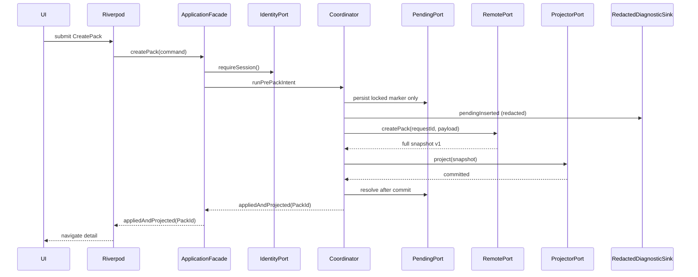
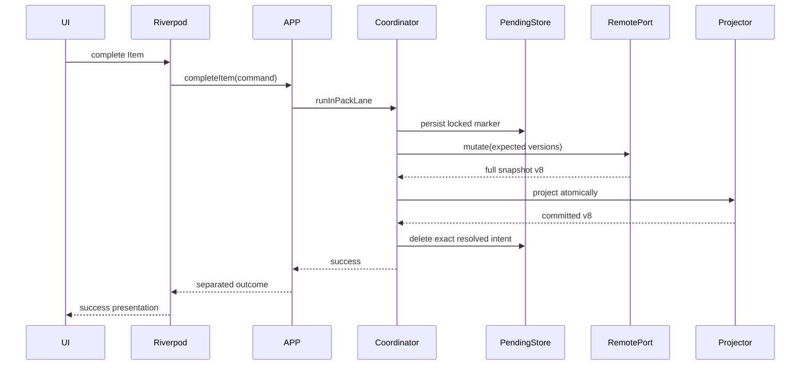
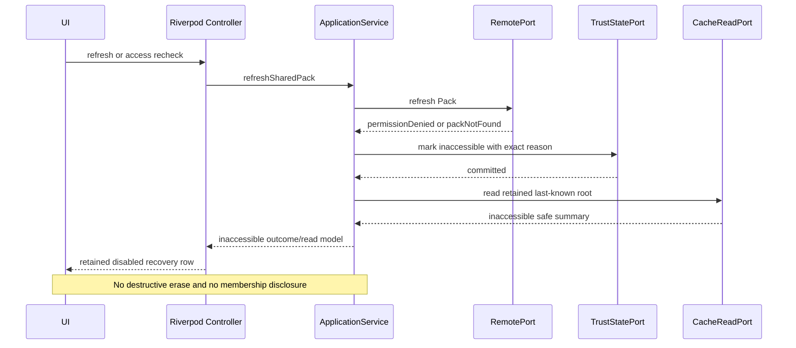
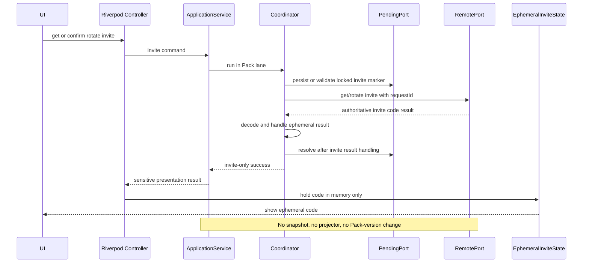
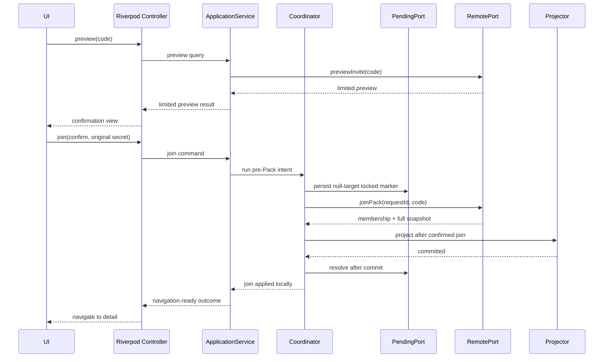
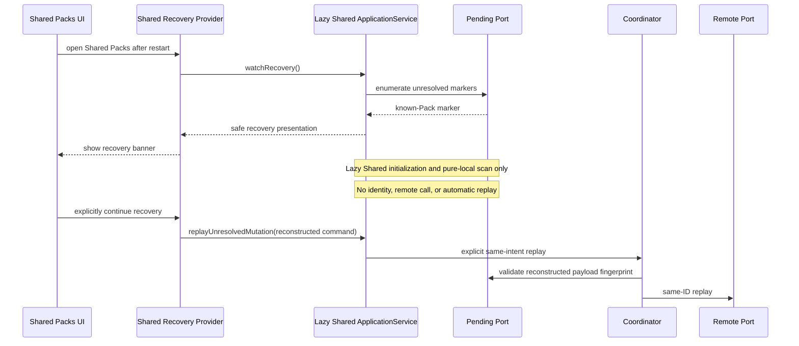
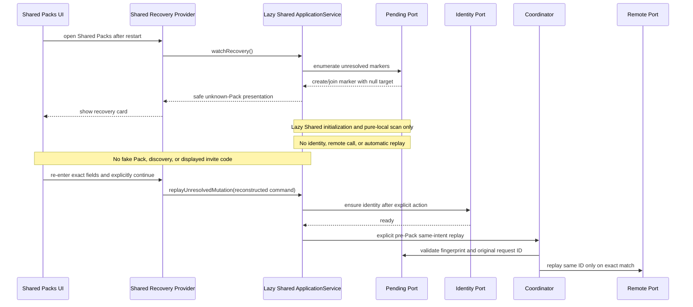
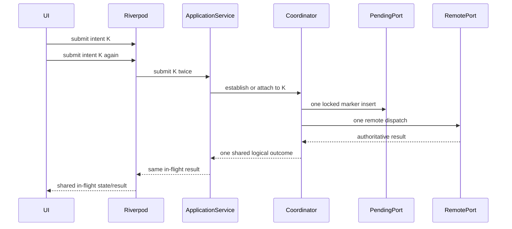

# Shared Pack Application, UI & Test Contract v1

## 1. Document Status

**Status: Phase 1f COMPLETE — documentation-only technical design gate**

- Branch: `ver-1.3.2`.
- Starting HEAD: `c01f384864d7124efdc02cdc812a81e7e5b79340` (`define Shared Pack remote security and RPC design`).
- Inspection date/timezone: 2026-08-05, Asia/Hong_Kong.
- Starting working tree: clean; `git status --short` returned no entries.
- Pre-existing changes: none.
- Phase 1f Gate Review corrective-patch baseline: branch `ver-1.3.2`, HEAD `30d22d50b7a09e98a9b79b412ce27eb4161e0a39`, inspected on 2026-08-06, Asia/Hong_Kong; the corrective-patch starting working tree was clean with no pre-existing changes. This does not replace the original Phase 1f baseline above.
- Runtime implementation: absent. No production Shared Pack feature, route, provider, identity flow, local table, DAO, remote adapter, SQL, RPC, RLS policy, or executable Shared test exists.
- Schema state: the Phase 1 design target remains `driftSchemaVersion = 6`; production `AppDatabase.schemaVersion` remains 5.
- Dependency state: `supabase_flutter` is not present. Riverpod is `flutter_riverpod ^2.6.1`; GoRouter is `go_router ^17.2.0`.
- Change class: this phase adds only this Markdown contract. It does not create or modify production/runtime/test implementation.
- Phase order: after this gate, only Phase 2a may begin. Phase 3 and Phase 4 cannot be started directly from Phase 1f.

Decision vocabulary:

- **Locked**: later phases MUST preserve the decision unless its upstream authority is deliberately revised first.
- **Design target**: an exact future contract or pseudocode shape, not evidence of current implementation.
- **Evidence**: an observation from the inspected repository.
- **Deferred**: only a non-P0 implementation detail assigned to a named later phase; it cannot weaken locked semantics.

No irreconcilable conflict was found among the source authorities. Historical HEAD values inside documents 09–13 are their own phase baselines, not the baseline of this phase.

## 2. Purpose and Scope

Phase 1f closes the application-facing decisions required before implementation:

- one Shared application facade and all inward-facing ports;
- exact commands, local queries, immutable read models, outcomes, failures, and recovery semantics;
- Riverpod composition, provider lifecycle, state separation, and override seams;
- exact route map and the `More → Shared Packs` dedicated flow;
- owner/member, trust, pending, failure, and recovery presentation;
- a deterministic Fake Remote contract;
- automated test architecture, Phase 2/3/4 ownership, Scenario A–H traceability, and final manual UAT;
- a concrete diagnostic-event/redaction boundary;
- the final Phase 1 Go/No-Go decision and Phase 2a handoff.

This phase does not implement any of those shapes. It does not add Dart, Drift, Supabase, SQL, RPC, RLS, dependencies, routes, providers, UI, fakes, generated files, or tests.

Shared Pack v1 still excludes fixed Items, recurrence/timezone, Resources, StageTracker, templates, skip, defer, undo, history, archived browsing/restore, leave/removal/owner transfer, Pack deletion, Personal-to-Shared conversion, discovery, account binding/recovery, realtime, background sync, automatic retry, outbox, Home, Activity, global Item management, notifications, Home Widget, and Personal backup recovery.

## 3. Repository Evidence

### 3.1 App composition and navigation

| Evidence | Current implementation | Consequence |
| --- | --- | --- |
| App entry | `lib/main.dart` wraps `ReminderApp` in one `ProviderScope` | Future Shared providers use normal Riverpod overrides; no second global container |
| App root | `ReminderApp` watches `appRouterProvider`; `AppBootstrap` wraps `MaterialApp.router` | Shared composition may be injected lazily; startup must not require it |
| Bottom navigation | `StatefulShellRoute.indexedStack` with `首頁 / 事項 / 動態 / 更多` | No fifth Shared tab |
| Route registration | `lib/app/router.dart`, named GoRoutes using constants on page classes | Phase 4 registers the locked named routes there |
| Current ID routes | Personal detail/edit routes parse opaque path parameters inside builders | Shared routes pass remote IDs as path parameters, never authoritative snapshots |
| `state.extra` | Personal Item routes use it for a non-authoritative `lockedPackId` seed | Shared authoritative DTO/snapshot MUST NOT use `extra` |
| More page | Compact `_MoreEntryRow` entries inside `ReminderEditorSection`, normally using `pushNamed` | Add one compact Shared Packs row in Phase 4, not a grid or tab |

### 3.2 Providers and startup

- Providers are handwritten Riverpod 2.x `Provider`, `StreamProvider`, `FutureProvider.family`, and `StateNotifierProvider.autoDispose`; there is no Riverpod code generation dependency or generated provider style.
- `appDatabaseProvider` constructs `AppDatabase` and closes it with `ref.onDispose`.
- Personal repositories are concrete providers over `appDatabaseProvider.reminderDao`.
- Personal Home combines `ItemRepository`, `ResourceRepository`, and `StageTrackerRepository`; attention, notification/badge, and Home Widget are downstream of that Personal graph.
- `AppBootstrap` initializes Personal attention sync and the existing Home Widget bridge. It contains no Shared identity, pending scan, refresh, recovery, or remote call.
- Normal launch therefore does not currently require Shared identity. Future Shared initialization remains lazy and scoped to a Shared route/flow.

### 3.3 Data, backup, reset, and tests

- `AppDatabase.schemaVersion` is 5 and registers only Personal tables plus `ReminderDao`.
- `ReminderDao`, `ItemRepository`, and `HomeRepository` are Personal/local-first. Their types include `Item`, `ItemBundle`, and `ItemPack`; none is a Shared extension point.
- `ReminderDao.exportBackupData` explicitly constructs the eight Personal backup collections. It does not enumerate every database table.
- `replaceUserDataFromBackup` inserts explicit Personal tables; `_clearUserData` deletes an explicit child-first Personal table list. This structure can preserve future Shared cache/trust/pending rows by keeping them outside those lists.
- Home Widget code reads `HomeAttentionSource`/`HomeRepository`, serializes Personal snapshot rows, and mutates through Personal `ItemRepository`. It has no Shared dependency.
- Tests are currently flat files under `test/`. `test/migration_test.dart` opens a fresh in-memory current-schema database and asserts version 5; it does **not** execute a historical v5→v6 migration.
- `test/backup_service_test.dart` covers the current Personal export/import/reset behavior but cannot yet prove preservation of nonexistent Shared v6 rows.
- Required repository search across `lib`, `test`, `pubspec.yaml`, `android`, and `ios` found no production match for Shared Pack/Supabase/runtime-contract identifiers.
- Actual source paths use `docs/core/04_core_model_spec_v1.md`, plural `database_providers.dart`, and `test/backup_service_test.dart`. No top-level `docs/04_core_model_spec_v1.md` exists.

These are current facts. The v6 schema, Shared providers, routes, and UI below are design targets, not implementation evidence.

## 4. Locked Inputs from Phases 1a–1e

| Concern | Locked input |
| --- | --- |
| Feature ownership | Independent `lib/features/shared_packs/` root with `domain`, `application`, `data/local`, `data/remote`, `providers`, and `ui` |
| Authority | Remote is authoritative; local Shared Drift is a readable full-snapshot projection |
| Mutation owner | Shared application owns every Shared mutation, coordination lane, trust/pending gate, logical ID, and recovery policy |
| Projection | One projector handles every full snapshot from create/join/mutation/replay/refresh; never a mutation fragment |
| Cache trust | Exactly `verified`, `needsRevalidation`, `inaccessible`; failure reasons are the nine exact Phase 1d codes |
| Pending | Durable minimal marker, not an outbox; no body, schedule, worker, automatic TTL, startup replay, or automatic remote work |
| Retry identity | Same logical retry uses the same UUID-v4 `clientRequestId` and identical SPMF-1 semantic payload |
| Outcome separation | Remote success and local projection/trust/pending outcomes remain separate |
| Remote surface | Exactly eleven RPC operations; no generic dispatcher or direct table CRUD |
| Roles | Owner manages metadata, active Item definitions, archive, and invite; owner/member view and complete |
| Invite | Get/create and rotate return invite-only results with no snapshot/projector/Pack-version change; preview is a minimum read; successful join increments Pack version and returns a full snapshot for projection |
| Discovery | Shared list is local cache only; no `listMySharedPacks` or membership recovery scan |
| Identity | Anonymous identity is lazy inside authorized Shared flows only |
| Personal boundary | Personal reset preserves Shared cache/trust/pending/identity; export excludes Shared; import preserves Shared |
| Excluded consumers | No Home, Activity, global Item management, Widget, notification, backup, background, or realtime integration |
| Item scope | State-based, active/archived, done only; no fixed, history, undo, skip, defer, pause, or restore |
| Projector integrity | SPCS-1/SHA-256; Pack version never decreases; equal version/different content fails closed; exact `notModified` only |
| Runtime | Exact per-Pack FIFO lanes plus mandatory database guard; different Packs can progress concurrently |
| Remote security | Supabase/PostgreSQL is a Phase 3 target; RPC-only, stable errors, exact idempotency replay with no automatic expiry |

## 5. Application Architecture Contract

### 5.1 Formal ownership and dependency direction

Inward-facing ports are **owned by `shared_packs/application/`**. This is locked. They express application orchestration needs—projection/trust composition, pending intent, remote dispatch, coordination, identity, clock/ID, diagnostics, and presentation mapping—not pure domain entities. Pure immutable Shared concepts and validation value types live in `shared_packs/domain/`.

```text
lib/features/shared_packs/
  domain/          Shared concepts/value semantics; no Flutter/Riverpod/Drift/Supabase
  application/     facade, commands/queries/outcomes, inward ports, coordination policy
  data/local/      Drift-backed implementations of cache/projection/trust/pending ports
  data/remote/     strict DTO/RPC adapter implementing the remote port
  providers/       Riverpod composition and UI-facing state adapters
  ui/              dedicated Shared pages/widgets only
```

```text
UI → Providers → Application → application-owned inward ports
                                  ↑                 ↑
                         Local adapter       Remote/identity adapter
```

Locked prohibitions:

- application imports no concrete Drift DAO, `AppDatabase`, Supabase client, GoRouter, or widget;
- providers own no lock, trust, pending, retry, fingerprint, dispatch-certainty, or version policy;
- UI directly reads no database/DAO/remote client and patches no cache;
- Shared providers never feed Personal Home/Widget/notification providers;
- no generic repository combines Personal and Shared types or authority.

Exact private Dart file splitting is deferred to Phase 2a; the public semantic placement and dependency direction are not.

### 5.2 Port catalog

The pseudocode uses `Future` for one-shot I/O, `Stream` for cache observation, and exhaustive sealed results rather than raw exceptions.

```dart
abstract interface class SharedPackApplicationService {
  Stream<SharedPackListReadModel> watchPackList();
  Stream<SharedPackDetailReadModel?> watchPackDetail(RemotePackId packId);
  Stream<UnresolvedMutationPresentation> watchRecovery();

  Future<SharedCommandOutcome<SharedPackDetailReadModel>> createSharedPack(CreateSharedPackCommand c);
  Future<SharedCommandOutcome<SharedPackDetailReadModel>> updateSharedPackMetadata(UpdateSharedPackMetadataCommand c);
  Future<SharedCommandOutcome<SharedItemReadModel>> createSharedItem(CreateSharedItemCommand c);
  Future<SharedCommandOutcome<SharedItemReadModel>> updateSharedItem(UpdateSharedItemCommand c);
  Future<SharedCommandOutcome<ArchivedSharedItemResult>> archiveSharedItem(ArchiveSharedItemCommand c);
  Future<SharedCommandOutcome<SharedItemReadModel>> completeSharedItem(CompleteSharedItemCommand c);
  Future<SharedCommandOutcome<InviteCodePresentation>> getOrCreateInviteCode(GetInviteCommand c);
  Future<SharedCommandOutcome<InviteCodePresentation>> rotateInviteCode(RotateInviteCommand c);
  Future<SharedQueryOutcome<InvitePreview>> previewInviteCode(PreviewInviteQuery q);
  Future<SharedCommandOutcome<SharedPackDetailReadModel>> joinSharedPack(JoinSharedPackCommand c);
  Future<SharedRefreshOutcome> refreshSharedPack(RefreshSharedPackCommand c);

  Future<SharedCommandOutcome<Object?>> replayUnresolvedMutation(ReplayUnresolvedMutationCommand c);
}
```

| Port | Owner / caller | Responsibility and async result | Allowed dependency / implementation phase | Explicit non-responsibility | Test double |
| --- | --- | --- | --- | --- | --- |
| `SharedCacheReadPort` | application / providers through facade | `watchPackList()`, `watchPackDetail(packId)`, `readMutationBase(packId)`, `watchRecoveryMarkers()` | Implemented with Shared DAO in 2c | No dispatch, trust transition, mutation policy, discovery | In-memory stream store |
| `SharedProjectionPort` | application coordinator | `projectFullSnapshot(snapshot, successTrust)` and `verifyNotModified(context, response, successTrust)` return Phase 1c semantic outcomes; graph/freshness/trust success commits atomically | Validator/projector + Shared DAO in 2d/2e/2f | No remote call, retry, UI copy, pending deletion | Deterministic projector fake plus fault injector |
| `SharedTrustStatePort` | application coordinator | Read trust; narrow `markNeedsRevalidation(packId, reason)` / `markInaccessible(packId, reason)` transactions | Shared local adapter in 2f | Does not decide when a transition is allowed | State-machine capture fake |
| `SharedPendingMutationPort` | application coordinator | Insert the locked marker before possible dispatch; get by operation/ID or Pack; update only the nullable learned Pack target; stream safe summaries; delete only with resolution proof | Shared local adapter in 2f | No executable payload, request/response body, persisted remote outcome, scan-to-send, TTL, or background work | In-memory durable-marker fake |
| `SharedPackRemoteApi` | application coordinator | Eleven operation-specific `Future<RemoteCallResult<T>>` methods; strict transport result includes dispatch certainty and stable semantic envelope | Fake in 2g; Supabase adapter in 3g | Does not create/replace request ID, write local DB, retry, map UI copy, or bypass strict decode | Scripted Fake Remote in Section 15 |
| `SharedIdentityService` | application facade | `currentIdentity()` and lazy `ensureIdentity()` return `IdentityReady` or semantic pre-dispatch failure | Fake in 2g; Supabase Auth in 3a | No general-startup initialization, profile, display-name authority, discovery | Scripted identity fake |
| `SharedRequestIdSource` | application coordinator | `nextUuidV4()` returns canonical secure lowercase UUID v4 once per accepted intent | 2f | No retry regeneration or payload fingerprinting | Sequence generator |
| `SharedUtcClock` | application/coordinator/diagnostics | `nowUtc()` only; returns UTC instant | 2a/2f | No authoritative server timestamp; no device-local business time | Fixed/advancing clock |
| `SharedPayloadFingerprintService` | application coordinator | SPMF-1 canonicalization + SHA-256 for exact semantic command | 2d/2f | No snapshot fingerprint; no payload storage/reconstruction | Golden-vector fake/real implementation |
| `SharedPackCoordinator` | application facade | `runInPackLane(packId, work)`, `runPrePackIntent(key, work)`, duplicate attachment, cancellation and registry cleanup | 2f | No DB truth replacement, remote call by itself, global mutex | Controllable lane fake |
| `SharedDiagnosticSink` | application and adapters through redacting wrapper | Emit safe structured `SharedDiagnosticEvent`; best-effort `FutureOr<void>` | Capture sink in 2g; no-op production default | Not history, recovery proof, user messaging, raw exception store | Capture sink |
| `SharedUserMessageMapper` | provider/controller | Pure `SharedUserMessage map(SharedOutcomeView)` | 2g/4 | Does not alter outcomes, authorize, log, or choose retry IDs | Golden mapping table |

Local/projector ports may be implemented by one adapter, but the atomic projection boundary remains one call. The local adapter never decides whether dispatch is allowed. Remote and identity implementations map all thrown/transport conditions into semantic port results; raw exceptions never cross the application boundary.

### 5.3 Remote port pseudocode

```dart
abstract interface class SharedPackRemoteApi {
  Future<RemoteCallResult<CreatePackRemoteSuccess>> createSharedPack(CreatePackRemoteRequest r);
  Future<RemoteCallResult<SnapshotMutationRemoteSuccess>> updateSharedPackMetadata(UpdatePackRemoteRequest r);
  Future<RemoteCallResult<SnapshotMutationRemoteSuccess>> createSharedItem(CreateItemRemoteRequest r);
  Future<RemoteCallResult<SnapshotMutationRemoteSuccess>> updateSharedItem(UpdateItemRemoteRequest r);
  Future<RemoteCallResult<SnapshotMutationRemoteSuccess>> archiveSharedItem(ArchiveItemRemoteRequest r);
  Future<RemoteCallResult<InviteCodeRemoteSuccess>> getOrCreateInviteCode(GetInviteRemoteRequest r);
  Future<RemoteCallResult<InviteCodeRemoteSuccess>> rotateInviteCode(RotateInviteRemoteRequest r);
  Future<RemoteCallResult<InvitePreviewRemoteSuccess>> previewInviteCode(PreviewInviteRemoteRequest r);
  Future<RemoteCallResult<JoinRemoteSuccess>> joinSharedPack(JoinRemoteRequest r);
  Future<RemoteCallResult<SnapshotReadRemoteSuccess>> getSharedPackSnapshot(GetSnapshotRemoteRequest r);
  Future<RemoteCallResult<SnapshotMutationRemoteSuccess>> completeSharedItem(CompleteItemRemoteRequest r);
}

sealed class RemoteCallResult<T> {
  RemoteSuccess<T>(T value, {required bool replayed});
  RemoteRejected(RemoteErrorCode code, SafeRemoteDetails? details, Duration? retryAfter);
  RemoteTransportFailure(DispatchCertainty certainty, TransportFailureFamily family);
  RemoteDecodeFailure(DispatchCertainty certainty);
}
```

The remote adapter accepts the application-supplied ID and semantic request. It preserves exact operation names and versions and never logs an invite code, raw request, raw response, snapshot body, token, or server message.

## 6. Commands and Immutable Semantic Types

All types are Shared-specific. Transport DTOs are decoded into application/domain types and never become UI models. Personal `Item`, `ItemBundle`, `ItemPack`, `ItemActionRecord`, and `FixedItemConfig` are forbidden.

```text
RemotePackId, RemoteMemberId, RemoteItemId, ClientRequestId
SharedRole = owner | member
SharedCacheTrust = verified | needsRevalidation | inaccessible
SharedItemAttention = normal | warning | danger
SharedItemLifecycle = active                         // readable v1 cache only
```

| Type | Locked fields / semantics |
| --- | --- |
| `SharedPackMetadataDraft` | exact validated `title`, nullable `description`, `iconEmoji` |
| `SharedItemDefinitionDraft` | title, nullable description, required initial anchor for create only, info/warning/danger minutes; state-based only |
| `MembershipDisplayNameInput` | canonical trimmed 1–40 Unicode scalars under the locked whitespace set |
| `InvitePreview` | title, icon, join availability only; no remote Pack ID exposed to presentation before join |
| `InviteCodePresentation` | canonical code held only in ephemeral application/UI memory plus formatted display code; clearable/sensitive |
| `SharedPackListSummary` | remote Pack ID, title, icon, role, trust presentation, last verified instant, pending summary |
| `SharedPackDetailReadModel` | Pack metadata, version, current membership, members, active Items, trust/pending presentation, last verified instant |
| `CurrentMembershipReadModel` | exact remote member ID internally, display name, owner/member role |
| `SharedMemberReadModel` | remote member ID internally, display name, role, joined-at; duplicate names valid |
| `SharedItemReadModel` | Pack-scoped remote IDs, definition, anchor, thresholds, derived attention, actor attribution, item version, server instants |
| `ActorAttributionViewData` | exact actor member ID resolved first; display label from that membership; optional duplicate-name hint, never name-based identity |
| `TrustPresentation` | semantic trust, stable reason category, last verified time, canRefresh/recheck, mutation blocked flag |
| `PendingRecoveryPresentation` | operation category, known/unknown target, created time, safe available actions; never raw row/ID/fingerprint/payload |
| `SharedCommandOutcome<T>` | the six orthogonal outcome axes in Section 8 plus optional authoritative feedback/read model |

Command inputs are immutable and contain semantic fields, not provider/UI objects:

```text
CreateSharedPackCommand(metadata, ownerDisplayName)
UpdateSharedPackMetadataCommand(remotePackId, expectedPackVersion, metadata)
CreateSharedItemCommand(remotePackId, expectedPackVersion, definition, initialStateAnchorUtc)
UpdateSharedItemCommand(remotePackId, remoteItemId, expectedItemVersion, definition)
ArchiveSharedItemCommand(remotePackId, remoteItemId, expectedItemVersion)
CompleteSharedItemCommand(remotePackId, remoteItemId, expectedItemVersion)
GetInviteCommand(remotePackId)
RotateInviteCommand(remotePackId, confirmed)
PreviewInviteQuery(userEnteredCode)
JoinSharedPackCommand(userEnteredCode, memberDisplayName)
RefreshSharedPackCommand(remotePackId)
ReplayUnresolvedMutationCommand(operation, clientRequestId, reconstructedSemanticCommand)
```

Only the application service converts these into versioned remote requests, creates IDs/fingerprints, and selects coordination lanes.

## 7. Application Operation Catalog

### 7.1 Common mutation algorithm

Every mutation follows this order unless the per-operation table marks a step not applicable:

```text
pure local validation
→ lazy identity requirement
→ exact coordination lane/pre-Pack single flight
→ trust/role/version/pending preflight
→ create or validate one logical ID + SPMF-1 fingerprint
→ persist pending before possible dispatch
→ remote operation
→ classify dispatch and semantic result
→ one projector or invite-only handler
→ trust transition and pending resolution
→ publish separated outcome
```

A duplicate tap attaches to the in-flight logical future. Back navigation may detach UI but does not cancel an intent that may have dispatched.

### 7.2 Input, guard, and remote mapping

| Operation | Local validation | Identity | Coordination / version source | Pending | Remote operation / handling |
| --- | --- | --- | --- | --- | --- |
| `createSharedPack` | metadata + canonical owner name | ensure before intent/ID | pre-Pack `(operation, ID)`; no expected version | yes, null target | RPC create; full snapshot through projector; learn target Pack ID |
| `updateSharedPackMetadata` | metadata | existing/ensure if needed | exact Pack lane; Pack/detail cached version | yes, known target | RPC metadata; full snapshot projector |
| `createSharedItem` | state-based definition, anchor UTC, thresholds | existing/ensure | Pack lane; cached Pack version | yes, known target | RPC create Item; full snapshot projector |
| `updateSharedItem` | definition only; no anchor/actor/lifecycle | existing/ensure | Pack lane; cached Item version | yes, known target | RPC update Item; full snapshot projector |
| `archiveSharedItem` | target active and owner confirmation | existing/ensure | Pack lane; cached Item version | yes, known target | RPC archive; projected snapshot must omit Item |
| `completeSharedItem` | target active; baseline omits `clientOccurredAt` | existing/ensure | Pack lane; cached Item version | yes, known target | RPC complete; server actor/time; full snapshot projector |
| `getOrCreateInviteCode` | owner capability | existing/ensure | Pack lane; no version | yes, known target | invite result only; no projector/version change |
| `rotateInviteCode` | owner + explicit confirmation | existing/ensure | Pack lane; no version | yes, known target | invite result only; no projector/version change |
| `previewInviteCode` | canonicalizable six-character code | lazy ensure | pre-Pack read coalescing allowed; no version | no | preview RPC; ephemeral minimum preview only |
| `joinSharedPack` | code + canonical member name | lazy ensure | pre-Pack `(operation, ID)`; no expected version | yes, null target | join RPC; learn Pack ID; full snapshot projector |
| `refreshSharedPack` | exact local Pack ID | existing/ensure only inside Shared flow | Pack lane; send cached version when root exists | no | snapshot or `notModified`; inaccessible handling on permission/not-found |

### 7.3 Success, failure, recovery, and navigation

| Operation family | Success condition | Stable no-side-effect failure | Ambiguous / local failure | Trust and pending | Allowed next action / navigation |
| --- | --- | --- | --- | --- | --- |
| Create/join | authoritative success decoded **and required full projection/trust commit succeeds** | validation, identity pre-dispatch, rate limit, invalid invite, already member, returned internal error | possible dispatch/lost response; success + invalid/unsupported/projector failure | retain null/learned-target marker on uncertainty; no fake root | normal detail only after commit; otherwise recovery card and same-ID replay |
| Known-Pack snapshot mutation | success envelope + accepted initial/newer/identical/older-safe classification and required local handling | validation, confirmed pre-dispatch, terminal business errors; stale base changes trust; permission/not-found inaccessible | possible dispatch; success + validation/unsupported/conflict/commit failure | unresolved marker blocks new mutation; needs revalidation where locked | refresh and/or exact same-ID recovery; never ordinary resubmit; remain on form/detail if not committed |
| Invite mutation | authoritative code result handled ephemerally | terminal permission/rate/business failure | possible dispatch or decode loss | snapshot trust unchanged; pending still blocks new Pack mutation | exact same-ID replay only for original code/result; never refresh-as-proof |
| Refresh | accepted full snapshot or valid exact `notModified` | confirmed transport failure, rate limit | invalid/unsupported/conflict/projector failure | success may restore verified; permission/not-found becomes inaccessible; no pending row | stay on current/list surface; refresh/recheck may repeat because it is a read |
| Preview | minimum preview decoded | invalid/rotated/unknown unified, already member, rate limit | transport/decode failure | no trust/pending/cache | correct code, wait, or retry read; never discovery/navigation to detail |

For a snapshot-changing mutation whose remote success returns an older snapshot, Phase 1c proves the current cache is already newer. The mutation's pending marker may resolve after remote success classification, but an existing unrelated trust gate remains. Create/join cannot use this path without an existing target root.

Per-operation lifecycle closure (combined with the exact input/validation/identity/coordination/version/remote columns in §7.2):

| Operation | Success / navigation | Failure or ambiguous outcome | Trust / pending resolution | Same-ID replay and restart |
|---|---|---|---|---|
| `createSharedPack` | Initial full snapshot commits; navigate to learned Pack detail | Stable no-effect failure stays on form; ambiguity or post-success local failure stays off detail | No root on failure; null-target pending retained on uncertainty and resolved only after projection/proof | Re-enter all semantic fields, fingerprint-match, replay original ID; restart shows unknown-create card |
| `updateSharedPackMetadata` | Accepted snapshot commits; return/stay on refreshed detail | Stable no-effect failure is mapped; ambiguity blocks normal resubmit | Ambiguity/local failure → `needsRevalidation` + retained known-Pack pending; safe terminal failure resolves exact pending | Reconstruct old Pack version + metadata; restart shows Pack recovery banner |
| `createSharedItem` | Accepted snapshot commits; detail shows authoritative Item | Ambiguity/local failure never shows optimistic Item | Retain known-Pack pending and fail closed; refresh alone cannot prove this intent | Exact definition/anchor/version + same ID; restart banner identifies safe operation category |
| `updateSharedItem` | Accepted snapshot commits; return/stay on detail | Stale Item base requires refresh; ambiguity/local failure blocks replacement edit | Stable stale result resolves pending after trust mark; uncertain result retains it | Exact old Item version/definition + same ID; restart banner uses the operation marker plus independently retained cache/draft context only |
| `archiveSharedItem` | Accepted snapshot omits Item; detail remains | Stable stale target requires refresh; ambiguity leaves Item last-known | Accepted authoritative absence may prove effect; otherwise retain pending/revalidation | Exact Item ID/version + same ID; restart exposes archive recovery, never optimistic removal |
| `completeSharedItem` | Accepted snapshot supplies server actor/time/state; detail remains | Ambiguity never advances local anchor or claims failure | Same-ID authoritative result required; refresh alone cannot attribute request | Exact Pack/Item/base version + same ID; restart keeps complete disabled |
| `getOrCreateInviteCode` | Code appears only in sensitive state; no normal navigation | Stable failure maps safely; ambiguity clears code and blocks new Pack mutations | Snapshot trust/version unchanged; pending resolves only from authoritative invite result | Same Pack + same ID retrieves original active result; restart shows recovery without code |
| `rotateInviteCode` | Confirmed new code replaces old sensitive value | Ambiguity clears code; refresh cannot prove response | Snapshot trust/version unchanged; pending retained until exact replay/result | Same confirmed rotation + same ID; restart requires explicit sensitive recovery flow |
| `previewInviteCode` | Limited preview opens join confirmation; no cache write | Invalid classes unify; confirmed read failure permits explicit read retry | No Pack trust or pending mutation row; no Pack identity learned | No mutation replay/restart marker; user re-enters code for a new preview read |
| `joinSharedPack` | Full snapshot commits; then navigate to learned Pack detail | Stable invalid/already-member stays out of detail; ambiguity remains unknown | No fake root; null-target pending retained on uncertainty and resolved after projection/proof | Re-enter exact code/name, fingerprint-match, same ID; restart shows unknown-join card without code |
| `refreshSharedPack` | Full snapshot or exact `notModified`; stay on list/detail | Read transport failure is retryable; invalid response does not restore trust; permission becomes inaccessible | No pending insert; never clears unrelated pending without operation-specific proof | No mutation ID/replay; after restart user may explicitly issue a new refresh read |

### 7.4 Local queries

| Query | Source / output | Rules |
| --- | --- | --- |
| Shared Pack list stream | `SharedCacheReadPort.watchPackList()` → summaries | local projected cache only; includes inaccessible retained roots and joins unresolved create/join cards at presentation composition; no remote call |
| Pack detail stream | `watchPackDetail(remotePackId)` | local root/members/active Items; absent root remains absent; route creates nothing |
| Membership/current role | contained in detail read model | exact member IDs internal; duplicate display names legal |
| Active Item list | contained in detail read model | state-based active cache only; no archived browser |
| Pending/recovery stream | safe application summaries from pending + trust | UI never sees raw marker fields, fingerprint, request ID, or invite code; the pending row contains no payload |

All streams are cold/lifecycle-aware adapter streams and require no network to render cached content.

## 8. Result and Failure Taxonomy

`SharedCommandOutcome<T>` is an immutable product of independent axes. No axis may be inferred from another.

```dart
SharedCommandOutcome<T> {
  DispatchCertainty dispatch;       // notAttempted | confirmedNotDispatched | mayHaveDispatched | dispatched
  RemoteSemanticOutcome remote;     // notApplicable | rejectedNoSideEffect(code) | succeeded | replayedSuccess | unknown | idempotencyConflict
  LocalProjectionOutcome local;     // notRequired | committedInitial | committedNewer | verifiedSameVersion |
                                    // ignoredOlder | verifiedNotModified | invalidSnapshot | unsupportedSnapshot |
                                    // sameVersionConflict | integrityFailure | commitFailure |
                                    // staleNotModified | missingNotModified | invalidNotModified
  TrustOutcome trust;               // unchanged(state) | becameVerified | becameNeedsRevalidation(reason) |
                                    // becameInaccessible(reason) | durableMarkFailedEffectiveBlock
  PendingIntentOutcome pending;     // notCreated | insertedThenResolved | retained | deletedNoDispatch |
                                    // retainedFingerprintMismatch | retainedIdempotencyConflict
  NextAllowedAction next;           // correctInput | retryIdentity | newIntent | refresh | sameIdReplay |
                                    // refreshOrSameIdReplay | accessRecheck | waitRetryAfter | updateApp | none
  T? value;
  bool mayNavigateToNormalDetail;
}
```

These axes are non-persisted application outcomes. They add no wire code, trust value, pending column, or pending status. `PendingIntentOutcome` describes what the application did with the locked six-field marker; the only persisted pending status remains `awaitingResolution`. A current `RemoteSemanticOutcome.succeeded` is not written into that row.

Required mappings:

| Situation | Required axes |
| --- | --- |
| Local validation rejected | `notAttempted / notApplicable / notRequired / trust unchanged / notCreated / correctInput` |
| Identity unavailable before dispatch | `notAttempted / notApplicable / notRequired / unchanged / notCreated / retryIdentity` |
| Confirmed pre-dispatch transport failure | `confirmedNotDispatched / unknown or notApplicable / notRequired / unchanged / deletedNoDispatch / newIntent` |
| Timeout/lost response after possible dispatch | `mayHaveDispatched / unknown / notRequired / needsRevalidation(remoteOutcomeUnknown)` for snapshot mutation / `retained / refreshOrSameIdReplay` |
| Stable server rejection | `dispatched / rejectedNoSideEffect(code) / notRequired`; pending resolves; trust follows exact code |
| `staleVersion`, `itemNotFound`, `itemArchived` | no side effect; `needsRevalidation(staleMutationBase)`; pending resolves; `refresh` |
| `idempotencyConflict` | prior key outcome not proven; pending retained; snapshot mutation becomes unknown/revalidation; no payload switch |
| `permissionDenied` / `packNotFound` | no side effect for attempt; root becomes inaccessible and retained; request pending resolves; `accessRecheck` |
| Remote success + accepted snapshot | `dispatched/succeeded`, committed/verified local, verified trust, pending resolved; navigation allowed for create/join |
| Remote success + older snapshot no-write | remote success remains success; local `ignoredOlder`; pending can resolve after classification; freshness unchanged |
| Remote success + invalid/unsupported/conflicting snapshot | remote success; corresponding local failure; needs revalidation; pending retained; refresh/replay |
| Remote success + projection/commit failure | remote success; local commit failure; needs revalidation(projectionFailed); pending retained; refresh/replay |
| Valid exact `notModified` | read success; verified-not-modified; verified trust; freshness only |
| Stale/missing/invalid `notModified` | no verification; exact ignored/invalid local outcome; trust unchanged |
| Invite-only success | remote success; local not required; trust unchanged; pending resolved; sensitive result ephemeral |
| Same-ID replay success | `replayedSuccess`; handle the original snapshot-producing result through the projector, or the original invite-only result through the invite handler |
| Local pending fingerprint mismatch | no dispatch; remote not applicable; pending retained; fail closed; no new intent |

Raw exceptions, HTTP status, SQL messages, and a generic `success | failure` are not application contracts.

## 9. Retry and Recovery Application Contract

The v6 pending row is a durable marker only. Its complete persisted shape is exactly:

```text
operationName
clientRequestId
payloadFingerprint
targetRemotePackId? // nullable
createdAt
status = awaitingResolution
```

It stores no complete semantic payload, request body, response, or remote semantic outcome. A replayable command can come only from the still-live in-memory intent, an independent form draft, retained old cache, or explicit user re-entry. `payloadFingerprint` can verify a reconstructed semantic payload but can never reconstruct one. No persisted flag or marker records known remote success/application of a remote effect. A known remote semantic result may remain in the current in-memory application outcome only; durable remote-success/local-failure evidence is expressed separately on an existing Pack root as `trustState = needsRevalidation` and `trustFailureReason = projectionFailed`.

### 9.1 Known-Pack unresolved mutations

An unresolved known-Pack marker is shown as a calm Pack-level banner and recovery panel. It blocks every new mutation intent for that Pack, including a different Item or invite mutation. Read-only cached rendering and explicit refresh remain available unless access is inaccessible. The UI never offers “ignore”, “discard and retry”, payload editing under the same ID, or a new-ID retry.

| Operation | UI / blocked actions | Can refresh prove intent? | Same-ID reconstruction and replay | Resolution |
| --- | --- | --- | --- | --- |
| Update metadata | “上次的清單資料修改尚未確認”; block all mutations | Yes only if accepted snapshot version advanced beyond original expected version **and** all intended metadata exactly match | old expected Pack version + exact metadata; SPMF-1 must match | projector/replay success or exact effect-satisfied proof |
| Create Item | “上次新增提醒的結果尚未確認”; block all mutations | No; matching Item could come from another intent | exact old Pack version, definition, anchor, thresholds | same-ID authoritative result only |
| Update Item | identify target title from last-known cache; block all mutations | Yes only if Item version advanced and all intended definition fields exactly match | exact old Item version and definition | replay or effect-satisfied proof |
| Archive Item | show target as pending archive, not removed locally | Accepted absence from active snapshot proves terminal effect | old Item ID/version | replay or accepted absence |
| Complete Item | disable complete; do not locally advance anchor | No; snapshot cannot attribute current completion to this request | old Item ID/version + explicit confirmation; baseline has no client time | same-ID authoritative result only |
| Get/create invite | clear any prior visible code; block new mutations | No; invite is absent from snapshot | exact Pack ID | same-ID response returns original active code |
| Rotate invite | clear code on leaving screen; warn rotation result unknown | No | exact Pack ID | same-ID response returns original rotation result |

Fingerprint mismatch is a local terminal block for the replay attempt, not proof that the original failed. It produces no remote call, retains the marker, and shows: `重新輸入的內容與上次操作不一致，無法安全地重新送出。`

Refresh may restore Pack trust without resolving an operation whose effect it cannot prove. Therefore a Pack can be `verified` while an unresolved pending marker still blocks mutations. Pending deletion and trust recovery are separate decisions.

### 9.2 Unknown-Pack create/join pending

When `targetRemotePackId == null`:

- the Shared list shows a dedicated `尚未確認的建立操作` or `尚未確認的加入操作` card ordered ahead of normal empty-state copy;
- no fake Pack root, title row, membership, or detail route is created;
- no `listMySharedPacks`, membership scan, automatic refresh, or discovery call is allowed;
- the card has no “忽略並重做”, delete, normal retry, or new-intent action;
- after restart it remains visible from the local pending stream when the user opens Shared Packs; normal Personal startup still performs no Shared identity or remote work;
- the user may choose `繼續確認` and re-enter every original semantic field: create metadata/owner name, or canonical invite code/member name;
- the application computes SPMF-1 before dispatch. Exact match reuses the stored operation and `clientRequestId`; mismatch blocks before remote;
- if the request cannot be reconstructed, show `上次操作的結果仍未確認。這個裝置目前沒有足夠資料安全地重新送出。` The state remains unresolved and must not be described as failed;
- if a prior decoded success learned the Pack ID, the pending target is updated and normal Pack-lane projection/recovery becomes possible. A route still cannot fabricate a missing cache root.

### 9.3 Invite-only unresolved mutations

- Invite uncertainty never downgrades active-snapshot trust and never enters the projector or changes Pack version.
- Its pending marker still blocks new Pack mutation intents, because the logical result/code may already exist remotely.
- A Pack refresh cannot prove which active code was returned or that a rotation response was received.
- Only exact same-ID/same-payload replay safely retrieves the original get/create or rotation result.
- Invite code presentation is in-memory and screen-scoped. On route pop, replacement, app background, controller dispose, or successful copy timeout policy, the controller overwrites/clears the reference and returns to `codeHidden`; it is never persisted in cache, pending, diagnostics, clipboard history under app control, or logs.
- Copy is explicit. The UI states that a rotated old code stops working, but never exposes storage/security implementation.

### 9.4 Remote success / local failure

The application and UI MUST say that the operation may or did complete remotely while this device could not confirm/update the list. They MUST NOT use `操作失敗，請再試一次`, a normal resubmit button, a new ID, optimistic cache patch, or navigation to a fabricated success detail.

Safe next actions are:

1. explicit authoritative refresh for cache/trust recovery;
2. exact same-ID recovery when operation attribution remains required;
3. access recheck after permission/not-found;
4. no action when the client version is unsupported except update/later retry.

## 10. Riverpod Contract

### 10.1 Composition and provider catalog

Phase 2/4 uses the current non-codegen Riverpod style. No `riverpod_generator`, annotations, or build-runner provider generation is introduced.

```text
sharedUtcClockProvider                         Provider<SharedUtcClock>
sharedRequestIdSourceProvider                  Provider<SharedRequestIdSource>
sharedFingerprintServiceProvider               Provider<SharedPayloadFingerprintService>
sharedDiagnosticSinkProvider                   Provider<SharedDiagnosticSink>
sharedIdentityServiceProvider                  Provider<SharedIdentityService>
sharedCacheReadPortProvider                    Provider<SharedCacheReadPort>
sharedProjectionPortProvider                   Provider<SharedProjectionPort>
sharedTrustStatePortProvider                   Provider<SharedTrustStatePort>
sharedPendingMutationPortProvider              Provider<SharedPendingMutationPort>
sharedPackRemoteApiProvider                    Provider<SharedPackRemoteApi>
sharedPackCoordinatorProvider                  Provider<SharedPackCoordinator>
sharedUserMessageMapperProvider                Provider<SharedUserMessageMapper>
sharedPackApplicationServiceProvider           Provider<SharedPackApplicationService>

sharedPackListContentProvider                  StreamProvider<SharedPackListReadModel>
sharedPackDetailContentProvider                StreamProvider.autoDispose.family<SharedPackDetailReadModel?, String>
sharedRecoveryPresentationProvider             StreamProvider<UnresolvedMutationPresentation>
```

The family key is the exact opaque `remotePackId` string. It is not a local ID, title, object, lowercased value, or DTO.

- Adapter/service providers are overrideable at `ProviderScope`/`ProviderContainer` level. Phase 2g tests override remote, identity, clock, UUID, diagnostic sink, and fault-injected local ports independently.
- Shared runtime is initialized only when a Shared provider is first read by a Shared route/flow. That first read lazily creates/enables `SharedPackApplicationService`; its `watchRecovery()` facade method may then read recovery markers through the application-owned local port. The initial read is pure-local and cannot call identity or remote.
- Lazy Shared runtime initialization is a provider-composition and lifecycle property, not a second application facade. Shared providers access recovery markers only through `SharedPackApplicationService.watchRecovery()`.
- App restart and normal `AppBootstrap` do not initialize Shared runtime, scan pending, create identity, refresh, replay, or call remote. Only after the user opens a Shared surface may its provider lazily read the application recovery facade; identity/remote work still requires an explicit user recovery action.
- List streams may remain watched while the list page is mounted. Detail/form/command controllers are `autoDispose` and cancel local subscriptions on disposal.
- Disposing a controller detaches UI from a command; it cannot cancel a logical mutation after possible dispatch. The application-owned intent continues classification best-effort and persists pending evidence.
- Remote read cancellation is adapter best-effort. Local transaction/projector work that has started runs to a semantic outcome.
- No Personal Home, attention, Widget, notification, backup, or app-bootstrap provider watches a Shared provider.

### 10.2 State model rule

Cached content, initial local loading, remote refresh, command progress, trust, pending, message, and actions are independent fields. An all-screen `AsyncValue` MUST NOT replace the entire page during refresh or command work.

```dart
SharedSurfaceState<T> {
  T? cachedContent;
  bool isInitialLocalLoading;
  bool isRemoteRefreshInProgress;
  SharedCommandProgress? command;
  TrustPresentation trust;
  PendingRecoveryPresentation? pending;
  SharedUserMessage? message;
  SharedActionAvailability actions;
}
```

Required controller/state models:

| State | Additional fields and lifecycle |
| --- | --- |
| Shared Pack list | list content, inaccessible rows, unresolved unknown-Pack cards, local loading/error, no automatic refresh |
| Create Pack | metadata/name draft, validation, submit intent attachment, identity progress, outcome, navigation readiness |
| Join/preview | code draft, preview read state, display-name draft, rate-limit wait, join submit/recovery; preview never persists cache |
| Pack detail | cached detail, last verified display, trust/pending banners, role-derived actions, refresh state |
| Manual refresh | idle/in-flight/succeeded/failed plus message; never blanks cached detail |
| Invite | `codeHidden/loading/visible/unknownOutcome`, copy feedback, rotate confirmation, screen-scoped sensitive value |
| Metadata editor | base Pack version, immutable draft, field errors, submit/recovery state |
| Shared Item create/edit | base Pack/Item version, state-based definition draft, field errors, submit/recovery state |
| Complete Item | per `(packId,itemId)` command state, duplicate attachment, disabled while pending |
| Unresolved recovery | safe operation category, reconstructed-draft state, fingerprint match/mismatch, allowed refresh/replay actions |

Every controller delegates policy to the application facade. It may prevent obvious duplicate callbacks and build UI drafts; it does not create IDs, insert pending, choose trust transitions, or classify dispatch.

### 10.3 Derived action availability

The application exposes facts; a pure provider selector derives presentation actions. Remote authorization remains mandatory.

| Role | Trust | Pending / in-flight | Target | Visible/enabled actions |
| --- | --- | --- | --- | --- |
| Owner | verified | none | Pack active | edit metadata, create Item, invite, refresh |
| Owner | verified | none | active Item | edit, archive, complete |
| Member | verified | none | Pack active | view members/Items, refresh |
| Member | verified | none | active Item | complete only |
| Any | verified but temporally old | none | readable | same role actions remain enabled; show age subtly, refresh optional |
| Any | needsRevalidation | any | readable last-known | refresh/recovery only; all mutations disabled |
| Any | inaccessible | any | retained last-known | explicit recheck only; no normal detail mutation or invite/complete |
| Any | any | unresolved Pack pending | any | refresh where safe and exact recovery; all replacement intents disabled |
| Any | verified | command in flight | command target | duplicate tap attaches/coalesces; no new ID; conflicting mutations disabled |
| Owner | verified | none | archived/absent Item | no update/complete/archive action; no restore UI |

Access-scope “共享” markers use neutral/shared styling, never warning/danger attention color. Hiding a button is not authorization.

## 11. Route and Navigation Contract

### 11.1 Placement

Locked entry:

```text
More → Shared Packs
```

The entry is a compact More row consistent with the current page. It does not add a fifth bottom tab. Shared Items do not appear in Home, Items management, Activity, Home Widget, notifications, Personal Pack management/detail, or the existing global add FAB.

### 11.2 Exact route map

| Route name | Path | Input |
| --- | --- | --- |
| `shared-packs` | `/shared-packs` | none |
| `shared-pack-new` | `/shared-packs/new` | optional non-authoritative form seed only |
| `shared-pack-join` | `/shared-packs/join` | optional non-authoritative code text seed only |
| `shared-pack-detail` | `/shared-packs/:remotePackId` | exact opaque Pack ID |
| `shared-pack-edit` | `/shared-packs/:remotePackId/edit` | exact opaque Pack ID |
| `shared-pack-invite` | `/shared-packs/:remotePackId/invite` | exact opaque Pack ID |
| `shared-item-new` | `/shared-packs/:remotePackId/items/new` | exact opaque Pack ID |
| `shared-item-edit` | `/shared-packs/:remotePackId/items/:remoteItemId/edit` | exact opaque Pack + Item IDs |

Names use the repository's lower-kebab convention. Paths use the suggested stable hierarchy because it isolates Shared from Personal `/item/:id` and makes Pack context explicit.

Route rules:

- authoritative DTOs, snapshots, membership, versions, trust, and invite results never travel through `state.extra`;
- detail/edit pages observe local cache by path ID; route builders do not call remote or create rows;
- a missing local root renders a calm unavailable/not-on-device state and a back action. It does not synthesize a root or invoke discovery;
- create/join navigates to normal detail only after authoritative success and required projection/trust commit. Remote success plus local failure remains on recovery UI/list card;
- edit/create Item returns to detail only after required committed outcome; back never rewrites cache;
- leaving a route does not cancel a possibly dispatched logical intent;
- v1 adds no external invite deep link, universal link, QR route, or Pack discovery route.

## 12. UI Surface Contract

### 12.1 Shared Pack list

The only Pack-row data source is the local projected Shared cache. Rendering existing content requires no network or identity.

| State | Presentation / actions |
| --- | --- |
| Initial local loading | compact neutral progress placeholder; no remote request |
| Empty | paper-card copy `這個裝置上還沒有共享清單。`; primary `建立共享清單`, secondary `輸入邀請碼` |
| Verified row | emoji, title, low-interference `共享` marker, role, last verified relative time, pending-free chevron; tap detail |
| Needs revalidation | retain title/last-known summary, muted disabled treatment, banner copy and `重新整理`; no mutations |
| Inaccessible | **retain and display** disabled/unavailable row, generic copy and explicit `重新確認`; never hide/delete last-known graph |
| Unknown create/join | dedicated unresolved-action card from Section 9.2; no fake Pack row |
| Refresh | manual per-row/detail refresh; spinner does not hide cached content |

Retaining inaccessible rows is locked because v1 has no discovery and this may be the device's only recheck context. It does not make the Pack look normal or expose a hidden remote listing.

### 12.2 Shared Pack detail

Detail contains:

- emoji, title, optional description, and a neutral `共享` marker;
- current role in product language (`擁有者` / `成員`);
- members with duplicate names preserved;
- active state-based Shared Items;
- exact-ID-resolved minimum attribution (`由 {displayName} 完成`) and server completion time converted to device local display;
- last verified time and manual refresh;
- owner-only metadata, Item, and invite controls;
- trust/pending/recovery banner above actions.

It contains no archived browser, activity/history, realtime/online indicator, cloud/local wording, Supabase/auth wording, skip/undo/defer, or Personal content.

### 12.3 Shared Item

- Only state-based, active readable Items and done are supported.
- Attention derives from `nowUtc - stateAnchorDateUtc` against info/warning/danger minutes. Device timezone is presentation only.
- The access-scope marker never replaces normal/warning/danger attention rails/badges.
- Actor lookup uses exact `completedByMemberId → remoteMemberId`; duplicate display names remain valid. UI may show `同名成員` as a neutral hint in the member list, but never invent a unique name or infer identity from order.
- Complete disables while its logical intent is in flight/unresolved. Duplicate tap attaches; it does not optimistically advance the anchor.
- Owner sees edit/archive/complete. Member sees view/complete. Server reauthorizes every call.
- No fixed schedule form, history, skip, undo, defer, pause, restore, or archived state.

### 12.4 Invite flow

Owner flow:

1. Open Pack-scoped invite route.
2. Get/create retrieves the active code with a new logical ID, or replays an unresolved same ID.
3. Show formatted code only in screen-scoped sensitive state; explicit copy action.
4. Rotate requires confirmation: `產生新邀請碼後，舊邀請碼會立即失效。`
5. After rotate, show only the returned new code. Unknown outcome clears visible code and offers same-ID recovery.

Joiner flow:

1. Enter code; lazy identity begins only when preview is requested.
2. Preview shows title, icon, and availability only.
3. Enter Pack-scoped display name and confirm join.
4. Navigate only after the join snapshot commits locally.
5. `alreadyMember` uses generic explanatory copy and does not open/discover a Pack.
6. malformed, unknown, inactive, and rotated code use one low-information category.

Invite code never enters readable cache, the pending marker/table, diagnostics, log, screenshot automation fixture output, or route parameters.

### 12.5 Anonymous identity limitation

Show this once on first Shared create/preview/join flow and in an appropriate Shared-only explanation area:

```text
此裝置上的共享存取尚未受到帳號保護。
清除 App 資料、更換或遺失裝置後，可能無法恢復共享存取。
```

Do not say anonymous user, Supabase, UID, authenticated role, remote profile, account binding already exists, or device recovery is available.

## 13. UI Failure and Recovery Copy

The mapper produces a presentation-only machine category, default Traditional Chinese copy, CTA category, and severity. These mapper categories are derived from the §8 axes; they are not wire codes, persisted trust values, pending fields/statuses, or additional application outcome axes. For example, `remoteSuccessLocalFailure` is derived from `remote = succeeded` plus a failed local projection outcome. Copy remains calm, non-blaming, and does not claim an unknown fact.

| Machine category | Default copy | CTA / forbidden action |
| --- | --- | --- |
| `needsRevalidation` | `這份共享清單需要重新整理，完成後才能繼續操作。` | `重新整理`; no mutations |
| `remoteOutcomeUnknown` | `上次操作的結果尚未確認，請不要重複操作。` | `重新整理` when useful and/or `繼續確認` same-ID; no normal retry |
| `remoteSuccessLocalFailure` | `操作可能已完成，但此裝置未能更新共享清單。請重新整理確認最新狀態。` | `重新整理`; same-ID recovery when attribution remains; no new intent |
| `staleMutationBase` | `共享清單已有更新，請先重新整理再操作。` | `重新整理` |
| `inaccessible` | `目前無法使用這份共享清單。請重新整理以確認存取狀態。` | `重新確認`; no existence detail |
| `identityUnavailable` | `暫時無法開啟共享功能。你的個人提醒不受影響。` | `再試一次` means identity pre-dispatch only |
| `rateLimited` | `嘗試次數較多，請在 {time} 後再試。` | disabled until server retry-after; no security detail |
| `unsupportedApi` | `目前的 App 版本無法使用這項共享功能。請更新 App 後再試。` | `知道了` / platform update path; do not display partial remote data |
| `unsupportedSnapshot` | `這份共享清單需要較新的 App 版本才能顯示。` | update/later; keep old cache non-operable |
| `invalidInvite` | `這個邀請碼目前無法使用，請確認後再試。` | edit code; do not distinguish unknown/rotated/inactive |
| `alreadyMember` | `這個邀請目前無法用來加入新的共享清單。` | back; no discovered detail |
| `validationField` | field-specific bounded copy such as `請輸入名稱` or threshold order guidance | correct field; no raw server/SQL message |
| `confirmedNoDispatchTransport` | `目前無法連線，尚未送出操作。` | a genuinely new submit is allowed after state resets |
| `mayHaveDispatchedTransport` | `操作是否完成仍未確認，請不要重複操作。` | refresh/same-ID only |
| `idempotencyConflict` | `這次操作的內容與先前記錄不一致，無法安全地繼續。` | no resubmit; retain recovery marker |
| `internalReturnedNoEffect` | `暫時無法完成操作，請稍後再試。` | same intent/new intent only according to returned side-effect classification |

Warning/danger attention colors remain Item urgency signals. Shared access, trust, role, or pending uses neutral/amber-muted recovery styling and never masquerades as attention severity.

## 14. Diagnostic and Redaction API Contract

```dart
enum SharedDiagnosticEventType {
  laneQueued, laneAcquired, laneReleased,
  pendingInserted, pendingRetained, pendingResolved,
  dispatchNotAttempted, dispatchConfirmedNoSend, dispatchAmbiguous,
  remoteSemanticResult, projectorOutcome, trustTransition,
  sameIdReplay, duplicateCoalesced, fingerprintMismatch,
  recoveryProofAccepted, recoveryProofRejected,
  uiActionCategory
}

class SharedDiagnosticEvent {
  SharedDiagnosticEventType type;
  String operation;
  String? redactedPackId;
  String? redactedRequestId;
  int? packVersion;
  int? itemVersion;
  String stableCode;
  Duration? duration;
  String correlationId; // locally generated, non-secret
}

abstract interface class SharedDiagnosticSink {
  FutureOr<void> record(SharedDiagnosticEvent event);
}
```

Redaction ownership belongs to an application-owned `SharedDiagnosticRedactor` wrapper **before** any sink. Raw IDs are never fields on the public event constructor used by sinks.

Concrete developer-build redaction:

```text
sessionKey = 32 cryptographically random bytes generated once per process
token = kind + ":" + first12(lowercaseHex(HMAC-SHA256(sessionKey, UTF8(kind + "\0" + raw))))
```

The key is memory-only and never logged/persisted. Tokens correlate only within one process. Tests inject a fixed key. Production default is `NoOpSharedDiagnosticSink`; a developer diagnostic surface explicitly injects a capture sink. Diagnostic recording is best-effort and cannot affect business outcomes.

Allowed fields are those in the pseudocode. Forbidden everywhere in diagnostic events/sinks:

- invite code or digest, payload/snapshot fingerprint, auth/access/refresh/service credential;
- raw payload, raw response, snapshot body, descriptions, display names as identity;
- raw SQL/server message, exception text, stack trace, table/constraint names;
- a value used as membership discovery, activity history, or recovery proof.

`SharedUserMessageMapper` and diagnostic mapping are separate boundaries. Diagnostics can never decide trust, pending deletion, retry safety, or user copy.

## 15. Deterministic Fake Remote Contract

Phase 1f defines but does not implement the fake.

```dart
abstract interface class ScriptedSharedPackRemoteApi
    implements SharedPackRemoteApi {
  void enqueue(SharedRemoteOperation op, FakeRemoteStep step);
  FakeBarrier createBarrier(String name);
  List<FakeRemoteCallRecord> safeCallRecords();
  int callCount(SharedRemoteOperation op, {String? redactedPackToken});
  void assertNoUnexpectedCalls();
  void reset();
}

sealed class FakeRemoteStep {
  ImmediateRemoteResult(result);
  DeferredRemoteResult(barrier, result);
  ConfirmedPreDispatchFailure(family);
  AmbiguousTimeout({bool commitScriptedRemoteEffect});
  MalformedResponse(bytesCategory);
  ThrowBeforeDispatch(family);
}
```

Required capabilities:

- same interface and strict DTO/decode/projector seam as production;
- never writes or patches local DB;
- FIFO scripted responses per operation plus explicit barriers/completers to control response order;
- same-Pack interleaving and different-Pack concurrency;
- dispatch certainty: not attempted, confirmed not dispatched, may have dispatched, dispatched;
- idempotency ledger behavior for same ID/same semantic payload exact replay and same ID/different payload conflict;
- versioned full snapshots, `notModified`, stable wire errors, rate retry-after, permission loss;
- malformed/decode failure, unsupported schema, same-version different content, older response;
- invite get/rotate/preview/join and exact original code replay without exposing code in safe records;
- projection failure injected through a local fake/fault injector, never by the remote fake;
- injected clock and UUID source; no wall clock, network, Supabase, random scheduling, or global singleton.

Safe call-record schema:

```dart
FakeRemoteCallRecord {
  int sequence;
  SharedRemoteOperation operation;
  String redactedPackToken;
  String redactedRequestToken;
  int? expectedPackVersion;
  int? expectedItemVersion;
  String semanticPayloadFingerprint; // test-only capture, never user/production diagnostic
  DispatchCertainty dispatch;
  String scriptedStepId;
}
```

The exported record excludes invite code, invite digest, token, display name, raw request/response, and snapshot body. Tests that must validate invite normalization configure an expected request matcher inside the fake and receive only pass/fail; the secret is not copied into ordinary records or failure dumps. Snapshot fixtures are referenced by stable fixture ID and inspected through the strict decoder/projector tests, not dumped in logs.

Assertion API supports: exact call order/count, one ID across replay, one call for duplicate taps, no call on fingerprint mismatch/trust block, Pack-lane serialization, cross-Pack overlap, barrier release order, and zero unexpected calls.

## 16. Automated Test Contract

### 16.1 Test pyramid and exact phase ownership

Every client-side test below is deterministic: fixed clock, fixed UUID source, explicit fake barriers, stable fixture IDs, and no real network. An assertion on user-visible behavior must also assert the corresponding trust and pending state; checking only returned data is insufficient.

| Phase | Required automated ownership |
|---|---|
| **2a — Shared Feature Skeleton** | Domain/application semantic types; application facade and every port contract compile test; architecture test proving no forbidden Flutter, Riverpod, Drift, Supabase, Personal model, or transport DTO dependency crosses into domain/application contracts. |
| **2b — Local Schema** | Fresh v6 database; true historical v5→v6 migration; preservation of representative Personal rows; Shared constraints/indexes; Personal reset/export/import boundary with existing Shared cache/trust/pending rows. |
| **2c — Local Read Path** | Local Pack list/detail/member/active-item streams; duplicate display names; inaccessible row retention; unknown pending presentation query; proof that Personal providers/consumers have no Shared integration. |
| **2d — Decode & Integrity** | Strict DTO decode; UTC normalization/rejection; SPCS-1 canonical bytes and SHA-256 fixture vectors; supported-schema checks; validation/graph/fingerprint failure families. |
| **2e — Projector** | One-transaction full projection; monotonic Pack guard; equal-version conflict; missing-row deletion; rollback/no freshness advance; valid and invalid `notModified`. |
| **2f — Runtime Coordination** | Per-Pack lanes and cross-Pack overlap; durable pending lifecycle; SPMF-1 fixtures; restart; exact same-ID replay; trust transitions; cancellation after possible dispatch; recovery-proof acceptance/rejection; no automatic retry/worker. |
| **2g — Fake/Application/Provider Gate** | Deterministic Fake Remote; Riverpod overrides; application/provider integration; developer-only redacted diagnostic surface; complete Scenario A–H client gate. |
| **3 — Remote** | Supabase migration, grants/RLS and RPC pgTAP; transactional compare-and-set and idempotency; invite security; Dart remote-adapter encode/decode/error integration; two independent anonymous-session integration. |
| **4 — UI/Release** | Named route/widget tests; role/trust/pending capability and recovery-copy/action tests; Personal-surface exclusion; iOS and Android full UAT. |

The pyramid is: pure unit → local Drift → application with fakes → provider/controller → widget/router → Supabase SQL/pgTAP → Dart remote integration → two-session integration → manual UAT. Phase ownership is cumulative; no later layer substitutes for an earlier proof.

### 16.2 Mandatory P0 families

The following families block their owning phase:

- migration preserves representative rows in every affected Personal relation and creates valid empty Shared tables; a historical v5 fixture, not only a fresh schema, is mandatory;
- Personal export contains no Shared content; Personal import neither overwrites nor deletes Shared data; Personal reset preserves Shared cache, trust, pending, and identity boundary state;
- normal Personal launch does not initialize Shared identity, and local list observation performs no remote discovery call;
- local projection is one transaction, Pack-scoped, deletes removed remote rows, retains local metadata, updates the verified cache version/fingerprint, and rolls back completely on fault;
- strict decode rejects missing/extra-invalid fields, unsupported schema, malformed UUID/time/version, and a `notModified` response that violates its envelope;
- projection consumes full snapshots only; Pack version never decreases; projection failure changes neither projected version nor freshness;
- mutation does not send when local trust, request fingerprint, or expected-version prerequisites fail;
- retry reuses the original request ID and semantic payload; a new user intent gets a new ID;
- same ID/different payload is surfaced as idempotency conflict and never auto-repaired;
- pending survives restart; unknown-Pack pending creates no fake Pack; no page-load/startup automatic retry or background worker exists;
- remote success plus local projection failure retains recovery state and never reports full success;
- older completion cannot overwrite newer verified state; same version/different content invalidates trust;
- valid `notModified` is accepted only against a verified matching baseline;
- permission loss makes the Pack inaccessible without destructive local erasure or membership-discovery copy;
- two simultaneous UI actions for the same semantic intent coalesce; different Pack lanes can progress independently;
- same-Pack work serializes; different Packs demonstrably overlap;
- create/join unknown-Pack recovery survives restart without fabricating a remote Pack ID;
- members cannot use owner actions, while hidden controls never substitute for server authorization;
- invite operations do not change Pack version or enter the projector; invite code never enters readable cache, log, or diagnostics;
- duplicate display names resolve actor attribution by exact member ID;
- a stable confirmed remote rejection does not alter cache; remote success is never presented as confirmed remote failure;
- diagnostics contain only allowlisted fields and deterministic test tokens; secrets and raw server text are absent;
- all exact named routes build with valid parameters and redirect safely for missing/inaccessible Packs.

### 16.3 Stable scenario fixtures

Common fixture `SPF-BASE-01` contains Pack `P1` with `trustState = verified`, `trustFailureReason = null`, version 7, schema 1, fingerprint `F7`, owner member `M1`, member `M2`, items `I1@3` and `I2@1`, no pending mutation, and fixed time `2030-01-02T03:04:05Z`. `P2` is an independent verified Pack at version 4. Test fingerprints are symbolic fixture values; production diagnostics must not expose them.

#### SP-A — Older refresh completes late

- Target/layer: Phase 2g, application/provider integration with Fake Remote and real Phase 2e projector.
- Fixture/action: a refresh A dispatched by an old/disposed coordinator instance remains transport-live; a new instance sharing the same guarded local store issues refresh B. Release B with snapshot `P1@9/F9`, then the late A callback with `P1@8/F8`. A single live Pack lane is separately asserted never to authorize both concurrently.
- Fault/interleaving control: barriers `A_RESPONSE` and `B_RESPONSE`.
- Exact assertions: B projects once; A returns `LocalProjectionOutcome.ignoredOlder`; local cache remains version 9/F9 with `trustState = verified` and `trustFailureReason = null`; visible items match snapshot 9; no pending row is created; no user error is emitted.
- False-positive guard: assert A's snapshot-8 item unique to its fixture is absent and projector call count is one.

#### SP-B — Mutation and refresh cross

- Target/layer: Phase 2g, application/provider integration with lane/barrier fake.
- Fixture/action: a completion mutation from a prior coordinator instance is transport-live with expected Pack 7/item 3; a new instance sharing the guarded DB refreshes to snapshot `P1@9/F9`; the mutation's success snapshot `P1@8/F8` arrives afterward. Within one live instance, the same work must queue rather than cross.
- Exact assertions: one mutation dispatch with the fixed request ID; snapshot 9 projects; snapshot 8 is `ignoredOlder`; Item state remains exactly snapshot 9; trust remains `verified` at 9/F9; the mutation pending resolves only after its remote success and safe older-no-write classification.
- False-positive guard: assert the late mutation cannot restore its snapshot-8-only fixture row, cannot regress freshness, and cannot clear/replace an unrelated pending record.

#### SP-C — Remote success, local projection failure

- Target/layer: Phase 2g, application integration with Fake Remote plus local transaction fault injector.
- Fixture/action: update Pack name using request `R-C`; remote returns success snapshot 8; inject a transaction fault during projection.
- Exact assertions: the separated outcome axes are `dispatch = dispatched`, `remote = succeeded`, `local = commitFailure`, `trust = becameNeedsRevalidation(projectionFailed)`, `pending = retained`, `next = refreshOrSameIdReplay`, and `mayNavigateToNormalDetail = false`. No partial snapshot rows exist; cache version/fingerprint stay 7/F7. The pending row retains only `operationName`, `clientRequestId = R-C`, `payloadFingerprint`, nullable `targetRemotePackId`, `createdAt`, and `status = awaitingResolution`. The Pack root separately records `trustState = needsRevalidation` and `trustFailureReason = projectionFailed`. The current in-memory outcome may retain known remote success, but v6 pending persistence does not. UI copy is the retry-safe refresh/recovery copy, never “saved”.
- Reconstruction assertion: the complete semantic payload is absent from pending persistence and must come from the still-live intent, an independent draft, retained old cache, or user re-entry; the fingerprint verifies that reconstruction and cannot recreate it.
- Retry assertion: recovery first revalidates; it must not synthesize a new mutation ID or blindly mutate again.
- False-positive guard: assert returned remote success alone cannot trigger success navigation/snackbar.

#### SP-D — Ambiguous timeout and same-ID retry

- Target/layer: Phase 2g, restartable application integration with idempotent Fake Remote ledger.
- Fixture/action: send rename with request `R-D`; fake commits remote effect but returns ambiguous timeout. User retries after restart.
- Exact assertions: first ambiguity marks `P1` `needsRevalidation/remoteOutcomeUnknown` at local version 7 and retains pending; pending survives restart; retry dispatches byte-equivalent semantic command with `R-D`; fake replays snapshot 8; projection commits once; trust becomes `verified` at 8, pending clears, and user sees one successful rename.
- False-positive guard: assert UUID source was called once and remote mutation ledger has one semantic effect despite two transports.

#### SP-E — Same request ID, different payload

- Target/layer: Phase 2g, application integration with Fake Remote idempotency conflict.
- Fixture/action: fake ledger already holds `R-E` for name “Alpha”; attempt replay with `R-E` and name “Beta”.
- Exact assertions: the application-side SPMF mismatch case makes zero remote calls. In the separately scripted server-ledger mismatch case, remote returns stable `idempotencyConflict`; no projection; local version remains 7; unresolved record is retained; snapshot mutation trust is `needsRevalidation/remoteOutcomeUnknown`; UI does not offer blind retry; diagnostic family is allowlisted and redacted.
- False-positive guard: assert neither Alpha nor Beta is inferred as safe from local state, and no fresh ID is generated automatically.

#### SP-F — Same version, different content

- Target/layer: Phase 2e unit/Drift projector proof, repeated at Phase 2g through the application gate.
- Fixture/action: a snapshot-changing mutation for verified local `P1@7/F7` has a durable pending row; remote reports success but returns a valid-schema full snapshot version 7 with fingerprint `F7-X`.
- Exact assertions: projector rejects it; current rows/freshness/version 7/F7 are not overwritten; Pack trust becomes `needsRevalidation/sameVersionContentConflict`; mutation pending is retained; mutations are disabled; recovery offers authoritative refresh/same-ID evidence; diagnostic records `sameVersionContentConflict` without either fingerprint.
- False-positive guard: fixture includes a plausible changed display name so equality cannot be reduced to version only.

#### SP-G — Valid `notModified`

- Target/layer: Phase 2e projector/integrity proof, repeated at Phase 2g through the application gate.
- Fixture/action: verified local `P1@7/F7`; refresh sends known version 7 and receives well-formed `notModified` for version 7/schema 1.
- Exact assertions: no snapshot-row writes or delete/insert loop; trust remains verified (`trustState = verified`) and `trustFailureReason` remains `null`, last successful validation time advances, visible state is unchanged, the operation is successful, and pending state is untouched.
- Negative pair: the same response against an absent or known-untrusted baseline, mismatched version, or unsupported schema is rejected and cannot restore trust.

#### SP-H — Permission lost

- Target/layer: Phase 2g application/provider integration, then repeated in Phase 3 two-session integration.
- Fixture/action: refresh or mutation returns stable `permissionDenied` or authorized `packNotFound` for formerly accessible `P1`.
- Exact assertions: Pack state becomes `inaccessible` with its exact bounded reason; last-known graph/version 7 are retained but not presented as current; the terminal request's pending row is deleted only after the inaccessible trust mark commits, while unrelated pending rows remain; mutation and invite actions disable; list retains a non-discovering recovery row; explicit access recheck is the only recovery action; no membership facts or Pack existence are disclosed; no automatic destructive delete occurs.
- False-positive guard: assert raw 403/RLS/server text is absent from copy and diagnostics.

### 16.4 Provider, router, and widget assertions

Provider tests must prove per-Pack family scoping, application-scope disposal safety, immutable state replacement, same-intent coalescing, lane serialization, and independent Pack concurrency. They must assert action availability from role + trust + pending state, not hand-set booleans.

Router tests must exercise every route name and canonical path in §11 with direct deep links, back navigation, invalid/missing IDs, unknown local Pack, and inaccessible Pack. A stale detail deep link may land on the retained inaccessible state; it must not crash, reveal cached content as verified, or silently route to Personal items.

Widget tests must cover:

- More → Shared Packs entry placement and all list states;
- exactly four bottom destinations remain; no fifth Shared tab is created;
- list, create, join, exact Pack-detail ID, and Pack/Item editor routes build and navigate by their locked names;
- role labels, pending/trust badges, disabled controls, and one primary recovery action;
- owner/member action differences, with a separate server-authorization integration assertion;
- `verified`, `needsRevalidation`, and `inaccessible` rendering; merely old `lastVerifiedAt` while still `verified` does **not** disable mutations;
- editor validation and duplicate-submit prevention;
- owner-only invite reveal/rotate confirmation and secret clearing when the view closes;
- join preview that does not persist identity or Pack content before confirm;
- pending banner, remote-success/local-failure copy, unknown-outcome copy, exact copy keys from §13, and absence of raw exception/server text;
- anonymous identity limitation on identity-bearing surfaces.
- Personal Home, Items, Activity, Widget, and notification surfaces contain no Shared Item, and their provider dependency graphs contain no Shared provider.

Golden tests are optional and cannot replace semantic widget assertions.

## 17. Final Manual UAT Matrix

The final release run records platform, build SHA, remote migration SHA, data-directory/session identifiers, and evidence links. Environment tags are: `SD` single device; `2AS` two anonymous sessions; `2DD` two independent App data directories; `2PD` two physical devices; `IOS`; `AND`; `FI` fault-injection build; `LS` local Supabase stack; `DEP` deployed security prerequisite. Every row is executed on iOS and Android where marked `IOS+AND`; `2PD` is not satisfied by two sessions in one process.

| ID | Environment | Preconditions | Steps | Expected result | Execution phase |
|---|---|---|---|---|---|
| UAT-01 | SD, IOS+AND | Representative Personal data in a real v5 DB | Install v6 build and launch | Migration succeeds; all Personal data/behavior is preserved; valid empty Shared schema exists | 2b automation; 4 final |
| UAT-02 | SD, IOS+AND | At least one Shared Pack, trust row, and pending row plus Personal data | Run Personal reset | Personal data resets; Shared cache, trust, pending, and identity boundary state remain unchanged | 2b/4 |
| UAT-03 | SD, IOS+AND | Personal and Shared data exist | Export Personal backup and inspect/restore to a clean Personal fixture | Export contains no Shared content or invite/remote identity material | 2b/4 |
| UAT-04 | SD, IOS+AND | Existing Shared state and a valid Personal backup | Import the Personal backup | Personal data changes as expected; Shared cache/trust/pending are neither overwritten nor deleted | 2b/4 |
| UAT-05 | SD, FI, IOS+AND | Identity fake/capture starts uninitialized; Personal data exists | Launch and use only Personal Home/Items/Activity/More surfaces | Zero Shared identity initialization and zero Shared remote call | 2g/4 |
| UAT-06 | SD, DEP, IOS+AND | Owner session and verified Pack | Create, edit, then archive a Shared Item | All owner actions succeed through full snapshot projection; archived Item leaves active list; versions increase correctly | 3/4 |
| UAT-07 | 2AS, 2DD, DEP, IOS+AND | Owner A created Pack; member B joined | In B, inspect Pack, complete Item, attempt owner actions | View/complete work; metadata/create/edit/archive/invite are absent/disabled and server rejects any forged owner call | 3/4 |
| UAT-08 | 2AS, 2DD, DEP, IOS+AND | A and B have identical display names; one completes an Item | Refresh both and inspect attribution/members | Actor resolves by exact member ID and remains correct; duplicate names are preserved without invented uniqueness | 3/4 |
| UAT-09 | SD, DEP, IOS+AND | Owner and active Pack invite | Call get/create twice without rotation | Same active invite code returns; code is only ephemeral and Pack version is unchanged | 3/4 |
| UAT-10 | 2AS, 2DD, DEP, IOS+AND | Owner has active invite; second session can preview it | Rotate, then preview old and new codes | Old code becomes unusable; new code works; UI does not reveal why the old code is invalid | 3/4 |
| UAT-11 | SD, DEP, IOS+AND | Record Pack version before invite operations | Get/create, get again, rotate, preview | Pack version is identical before/after; no projector run is caused by invite-only results | 3/4 |
| UAT-12 | 2AS, 2DD, DEP, IOS+AND | A owns Pack; B has valid new invite | B previews/confirms join; both refresh | Membership for B appears in authoritative snapshots on both sides with matching identity/role | 3/4 |
| UAT-13 | 2AS, 2DD, 2PD, DEP, IOS+AND | A and B share Pack; active Item exists | A completes; B refreshes | Both show the same actor, server completion time, Item state, Pack/Item versions | 3/4 |
| UAT-14 | FI, SD, IOS+AND | `trustState = verified` at v7; scripted refreshes v8 and v9 | Start both; release v9 then v8 | v9 remains `verified`/visible with null failure reason; v8 returns `ignoredOlder`, performs no write, and cannot regress freshness/version | 2g/4 |
| UAT-15 | FI, SD, IOS+AND | `trustState = verified` at v7; mutation yields v8; concurrent refresh yields v9 | Cross responses in both possible orders | Final state is v9/`verified`; v8 may apply only before v9 and never overwrite it afterward; pending resolves correctly | 2g/4 |
| UAT-16 | FI, SD, IOS+AND | Completion commits remotely but first response times out ambiguously | Restart and use recovery retry | Original request ID/payload replay; completion occurs once; final snapshot projects and pending clears | 2g/4 |
| UAT-17 | FI, SD, IOS+AND | Submit control can fire twice before first frame settles | Double-tap complete/create | One logical intent, one request ID, one pending insert, one semantic remote effect | 2g/4 |
| UAT-18 | FI, SD, IOS+AND | `trustState = verified` at v7/F7; fixture returns v7 with different content/fingerprint | Refresh | Fail closed: no overwrite, trust becomes `needsRevalidation/sameVersionContentConflict`, mutations disable, safe recovery appears | 2e/2g/4 |
| UAT-19 | FI, SD, IOS+AND | Known cache and scripted stable confirmed no-side-effect remote rejection | Submit allowed mutation | Cache/version/freshness remain unchanged; pending resolves only from stable proof; exact mapped copy appears | 2g/4 |
| UAT-20 | FI, SD, IOS+AND | Remote returns mutation success snapshot; projector transaction is faulted | Submit mutation | UI never says remote failed or offers blind new-ID retry; no partial write; pending/revalidation recovery survives restart | 2g/4 |
| UAT-21 | FI, SD, IOS+AND | Pack is `needsRevalidation` | Attempt mutation, then complete authoritative refresh, then retry as a new user intent | First mutation is blocked without remote call; controls reopen only after verified projection; subsequent intent is allowed | 2g/4 |
| UAT-22 | FI, SD, IOS+AND | Verified matching baseline and valid `notModified` | Manual refresh | Only validation freshness advances; graph/version/fingerprint stay unchanged; trust remains `verified/null`; no delete/insert churn | 2e/2g/4 |
| UAT-23 | 2AS, 2DD, DEP, IOS+AND | B has cached access; A/server revokes B | B refreshes and tries actions | Pack becomes inaccessible/fail-closed; normal content/actions stop; safe retained recheck row gives no membership discovery detail | 3/4 |
| UAT-24 | 2PD, DEP, IOS+AND | Anonymous Shared access exists and limitation has been acknowledged | Clear App data on one device; relaunch and enter Shared flow | Access is not promised/recovered; product copy exactly and honestly states device-loss/data-clear limitation; other device/session remains unaffected | 4 |

Rows using `DEP` require the deployed Phase 3 RLS/grant/RPC security gate; the same semantic rows should first run against `LS` where practical. UAT evidence must include state assertions, not only screenshots. Secret-bearing screens use redacted evidence or record only pass/fail. This matrix is a contract only: **Phase 1f does not claim that any App UAT row has been executed.** A failed P0 row is a release `NO-GO` until fixed and rerun.

## 18. Sequence Diagrams

These diagrams are normative for responsibility and ordering; method names are illustrative where §5–§7 already define the exact semantic operation.

### 18.1 Local list read — no remote call

```mermaid
sequenceDiagram
  participant UI
  participant RP as Riverpod
  participant APP as ApplicationService
  participant LQ as LocalQueryPort
  UI->>RP: watch sharedPackListProvider
  RP->>APP: watchPackList()
  APP->>LQ: watchPackSummaries()
  LQ-->>APP: local stream
  APP-->>RP: safe list read model
  RP-->>UI: list state
  Note over APP,LQ: Pure local read; no identity and no RemotePort call
```

### 18.2 Create, project, then navigate



### 18.3 Mutation complete success



### 18.4 Ambiguous timeout and same-ID retry

```mermaid
sequenceDiagram
  participant UI
  participant RP as Riverpod
  participant APP
  participant COORD as Coordinator
  participant PEND as PendingStore
  participant REM as RemotePort
  participant DIAG as RedactedDiagnosticSink
  UI->>RP: rename
  RP->>APP: rename command
  APP->>COORD: run Pack intent R1
  COORD->>PEND: persist R1 + fingerprint
  COORD->>REM: rename R1
  REM--xCOORD: ambiguous timeout
  COORD->>DIAG: dispatchAmbiguous (redacted)
  COORD-->>APP: unknown outcome; marker retained
  APP-->>RP: unresolved, same-ID recovery
  RP-->>UI: confirmation required
  UI->>RP: retry reconstructed intent
  RP->>APP: replay unresolved
  APP->>COORD: replay reconstructed intent
  COORD->>PEND: load R1 and verify fingerprint
  COORD->>REM: replay R1 unchanged
  REM-->>COORD: original result
  COORD-->>APP: authoritative replay outcome
  APP-->>RP: separated outcome
  RP-->>UI: recovered presentation
```

### 18.5 Remote success, local projection failure

```mermaid
sequenceDiagram
  participant UI
  participant RP as Riverpod Controller
  participant APP as ApplicationService
  participant COORD as Coordinator
  participant REM as RemotePort
  participant PROJ as Projector
  participant TRUST as TrustStatePort
  participant PEND as PendingPort
  participant DIAG as RedactedDiagnosticSink
  UI->>RP: submit mutation
  RP->>APP: mutation command
  APP->>COORD: mutate R2 in Pack lane
  COORD->>REM: mutate R2
  REM-->>COORD: success snapshot v8
  COORD->>PROJ: project v8
  PROJ--xCOORD: transaction rollback
  COORD->>TRUST: needsRevalidation/projectionFailed
  TRUST-->>COORD: failure trust committed
  COORD->>PEND: retain existing locked marker only
  COORD->>DIAG: projectorOutcome(commitFailure)
  COORD-->>APP: remote succeeded; local commit failed
  APP-->>RP: separated recovery outcome
  RP-->>UI: refresh/same-ID recovery; no success navigation
  Note over COORD,PEND: No payload, response, or remote-success field is added to pending
```

### 18.6 Needs-revalidation gate

```mermaid
sequenceDiagram
  participant UI
  participant RP as Riverpod Controller
  participant APP as ApplicationService
  participant TRUST as TrustStatePort
  participant REM as RemotePort
  participant PROJ as ProjectionPort
  UI->>RP: attempt mutation
  RP->>APP: submit command
  APP->>TRUST: read effective Pack trust
  TRUST-->>APP: needsRevalidation
  APP-->>RP: blocked; refresh required
  RP-->>UI: disable mutation and show refresh
  UI->>RP: explicit refresh
  RP->>APP: refreshSharedPack
  APP->>REM: get authoritative snapshot
  REM-->>APP: snapshot or notModified
  APP->>PROJ: guarded verification/projection
  PROJ-->>APP: verified
  APP-->>RP: refresh outcome
  RP-->>UI: reopen actions if no pending gate remains
```

### 18.7 Permission loss to inaccessible



### 18.8 Invite get and rotate



### 18.9 Preview then join



### 18.10 Restart with known-Pack pending



### 18.11 Restart with unknown-Pack pending



### 18.12 Duplicate-submit coalescing



## 19. Decision Registers

### 19.1 Accepted application decisions

| ID | Decision |
|---|---|
| SP-APP-001 | Application layer owns remote, projection, pending, identity, clock/ID, and diagnostic ports; domain remains pure. |
| SP-APP-002 | One `SharedPackApplicationService` facade owns the eleven remote flows, local read/recovery flows, and application outcome taxonomy. |
| SP-APP-003 | UI reads Shared state locally; only explicit application operations access remote. |
| SP-APP-004 | Outcomes preserve dispatch, remote semantic, local projection, trust, pending, and next-action axes; they are never generic success/failure. |
| SP-APP-005 | A remote mutation is not user-visible success until its snapshot projection commits. |
| SP-APP-006 | Unresolved retries reuse the original request ID only after semantic fingerprint verification. |
| SP-APP-007 | Per-Pack lanes serialize dependent work; response version/fingerprint gates still defend late completions. |
| SP-APP-008 | Unknown-Pack create/join pending is modeled without a fabricated remote Pack ID and with controlled reconstruction/replay. |
| SP-APP-009 | Invite secrets are ephemeral and excluded from persistence, ordinary fake records, and diagnostics. |
| SP-APP-010 | Diagnostics are allowlisted, redacted before sinks, best-effort, and no-op by default in production. |
| SP-APP-011 | Pending persistence is exactly the six-field Phase 1b marker; payload reconstruction and current remote outcomes are independent in-memory/draft/cache/user-input concerns. |
| SP-APP-012 | Restart recovery scanning is lazy Shared-runtime-only and pure-local; normal bootstrap performs no scan, identity, remote call, or replay. |
| SP-APP-013 | Invite get/rotate handles one authoritative invite-code result, resolves pending after handling, and has no snapshot, projector, or Pack-version change. |

### 19.2 Accepted UI decisions

| ID | Decision |
|---|---|
| SP-UI-001 | Shared Packs enters through More; the existing four-tab shell does not change. |
| SP-UI-002 | Exact routes and names are locked by §11. |
| SP-UI-003 | Cached content, refresh, command, trust, pending, message, and actions remain separate Riverpod state axes. |
| SP-UI-004 | Inaccessible Packs retain a safe recovery row and hide remote content as current. |
| SP-UI-005 | Role, trust, and pending state jointly derive action availability and recovery controls. |
| SP-UI-006 | Route identity is exact opaque path ID; authoritative snapshots never travel through `extra`. |
| SP-UI-007 | Join is preview → confirm → project; preview alone does not persist Pack state. |
| SP-UI-008 | Anonymous identity limitations are stated honestly on identity-bearing Shared surfaces. |
| SP-UI-009 | Shared Item UI is Pack-scoped and must never merge into Personal Home/attention/widget views. |

### 19.3 Accepted test decisions

| ID | Decision |
|---|---|
| SP-TEST-001 | The fake is scripted, barrier-controlled, strict, and implements the production remote interface. |
| SP-TEST-002 | A–H scenarios are P0 and assert trust, pending, projection, calls, and user outcomes. |
| SP-TEST-003 | Historical v5→v6 migration and Personal non-regression are mandatory. |
| SP-TEST-004 | Exact test ownership is cumulative across Phase 2a–2g, Phase 3, and Phase 4. |
| SP-TEST-005 | pgTAP, adapter, and two-session suites own distinct remote proofs; no layer substitutes for another. |
| SP-TEST-006 | Scenario A–H trace to stable fixtures, faults, exact assertions, false-positive guards, and trust/pending/version outcomes. |
| SP-TEST-007 | Final UAT contains the exact 24 roadmap cases with environment prerequisites; every failed P0 row blocks release. |

### 19.4 Rejected alternatives

- UI direct Supabase calls or remote reads directly from widgets/providers;
- providers owning retry, trust, dispatch-certainty, or pending-resolution policy;
- generic application `success | failure` outcomes;
- one all-screen `AsyncValue` replacing cached content during refresh/commands;
- a fifth bottom tab;
- adding Shared Items to Home, global Items, Activity, Widget, or notifications;
- a hidden `listMySharedPacks` discovery/recovery call;
- placing infrastructure-facing ports in the pure domain package;
- clearing pending on transport success before projection commits;
- automatically issuing a new request ID after ambiguous failure;
- normal “try again” handling for an unknown remote outcome;
- automatic retry on page load/startup or any background worker/outbox;
- treating Pack version alone as snapshot identity;
- accepting `notModified` without a verified matching baseline;
- global serialization of all Packs or unconstrained same-Pack concurrency;
- persisting/logging invite codes for restart convenience;
- exposing raw server/RLS/exception text to users or diagnostic sinks;
- hiding or silently deleting an inaccessible Pack without recovery reasoning;
- transport DTOs as UI models or reuse of Personal Item models;
- a fake that patches local cache directly;
- route `extra` carrying an authoritative snapshot;
- widget visibility as authorization;
- nondeterministic fake delays, real-network unit tests, or screenshot-only acceptance;
- executable production/test skeleton implementation during Phase 1f.

### 19.5 Explicitly deferred, non-blocking decisions

Only these implementation details remain deferred:

- exact Dart file splitting beneath the locked layer directories — owner Phase 2a;
- internal private class names — owner of the implementing Phase 2 subphase;
- exact visual spacing and pixel values within `docs/ui/visual_direction.md` — owner Phase 4;
- final localized copy polish that does not change any locked semantic category, disclosure, or CTA — owner Phase 4;
- implementation-specific test helper/file names — owner of each test phase;
- the Phase 3 deployment product choice explicitly allowed by document 13 — owner Phase 3 deployment gate.

Public operations/outcomes, routes, action gates, inaccessible presentation, unknown-outcome recovery, Fake capabilities, Scenario A–H ownership, UAT, and Go/No-Go criteria are not deferred. No P0 application/UI/test ambiguity remains.

## 20. Phase 1 Final Gate

| Gate question | Result | Contract evidence |
|---|---|---|
| 1. Do all Phase 0.7 deferred decisions now have an owner and answer? | PASS | Documents 09–13 lock data/runtime/remote decisions; §§5–19 close application/UI/test decisions and §19.5 names the only implementation-detail owners. |
| 2. Are Drift schema, trust state, snapshot fingerprint, and projector locked? | PASS | §1 current/target distinction; §4 locked inputs; §§5, 8, 16 inherit and test documents 09–11. |
| 3. Are RPC signatures, wire errors, and permissions locked? | PASS | §4 inherits documents 12–13; §§5.3, 7–8 preserve their exact semantic boundary. |
| 4. Is `clientRequestId` restart/retry policy locked? | PASS | §§7–9, SP-D/SP-E. |
| 5. Does Personal reset/export/import vs Shared preservation have a test contract? | PASS | §§3.3, 16.1–16.2, UAT-02–04. |
| 6. Are application ports and result types locked? | PASS | §§5–8. |
| 7. Are Riverpod state separation and action gates locked? | PASS | §10. |
| 8. Are route map and UI recovery controls locked? | PASS | §§11–13. |
| 9. Can the Fake Remote execute Scenario A–H deterministically? | PASS | §§15–16.3. |
| 10. Are automated tests assigned to Phase 2a–2g, 3, and 4? | PASS | §16.1. |
| 11. Is final UAT complete? | PASS | §17 contains the exact 24 roadmap cases and environment prerequisites. |
| 12. Is Home/Widget/notification/discovery/outbox scope expansion absent? | PASS | §§2, 4, 11, 16.2, 19.4. |
| 13. Does any P0 TBD remain? | PASS — none | §§19.1–19.5 and all prior gate rows. |

The Phase 1f Gate Review corrective pass also confirms that pending persistence, invite-only responses, lazy restart scanning, exact contract vocabulary, and all normative diagram boundaries now match documents 10, 12, and 13 without extending their schema or RPC surface.

**Phase 1 final conclusion: GO — Phase 2a may begin.**

## 21. Phase 1f Exit Criteria

- [x] One application service and every inward-facing port have formal ownership, dependency, phase, non-responsibility, and double contracts.
- [x] All eleven remote operations plus local list/detail/membership/Item/recovery queries have exact application mappings.
- [x] Outcome taxonomy preserves remote dispatch/semantics, local projection, trust, pending, next action, and navigation separately.
- [x] Riverpod composition, lifecycle, state axes, overrides, and action gates are locked.
- [x] Exact route map and `More → Shared Packs` placement are locked without a fifth tab.
- [x] Owner/member/trust/pending capability matrix is complete.
- [x] UI failure/recovery copy never converts unknown/remote-success-local-failure into confirmed remote failure.
- [x] Inaccessible and unknown-Pack pending have safe, non-discovering presentation and recovery.
- [x] Deterministic Fake Remote can manufacture every P0 transport/version/idempotency/invite condition.
- [x] Scenario A–H are executable specifications with phase/layer, fixture, action, fault, assertion, false-positive, and trust/pending/version expectations.
- [x] Automated ownership is explicit for Phase 2a–2g, Phase 3, and Phase 4.
- [x] The final matrix contains exactly 24 roadmap UAT cases and environment prerequisites.
- [x] Diagnostic/redaction API is concrete and cannot become activity history or recovery evidence.
- [x] Pending persistence is exactly the six-field marker with one `awaitingResolution` status; payload/outcome persistence is not implied.
- [x] Invite get/rotate handles no snapshot, invokes no projector, and changes no Pack version.
- [x] Restart recovery scan is pure-local and lazy after a Shared surface opens; normal bootstrap performs no scan, identity, remote call, or replay.
- [x] All normative diagrams route UI/provider work through ApplicationService and leave lane/pending/dispatch policy with ApplicationService/Coordinator.
- [x] Phase 1 final gate is unambiguously GO.
- [x] No production implementation, upstream source rewrite, dependency, generated file, SQL, route/provider/UI implementation, or manual-UAT completion claim is present.
- [x] The working-tree change is only this Phase 1f document, and whitespace validation passes.

## 22. Phase 2a Handoff

Phase 2a is **Shared Feature Skeleton** only. It implements the Shared feature directories, pure domain/application semantic types, the one application facade contract, inward-facing port interfaces, exhaustive result types, and compile/architecture tests. It must not add Drift v6 tables/DAOs (Phase 2b), local streams (2c), decode/fingerprint implementation (2d), projector (2e), runtime/pending coordination (2f), Fake/providers (2g), Supabase, routes, screens, or any change to Personal feature meaning.

Phase 2a exit evidence:

1. every Shared-specific type named in §6 exists as immutable semantics without Personal model reuse;
2. the facade covers all eleven remote flows plus local list/detail/recovery queries;
3. every §5 port compiles with ownership/dependency direction enforced;
4. exhaustive outcome axes from §8 compile without raw-exception or generic success/failure leakage;
5. architecture tests prove no Flutter/Riverpod/Drift/Supabase/transport dependency in pure contracts;
6. no runtime adapter, database schema, provider, route, or UI behavior has been added;
7. formatting, `flutter analyze`, and full `flutter test` pass, and source-of-truth docs are updated only for facts actually implemented.

This document closes documentation Phase 1f. It authorizes Phase 2a planning and implementation but contains no production implementation itself.

## 23. Phase 1f Validation Record

Executed on the repository state identified in §1 after completing the original document and this corrective patch:

| Check | Result |
|---|---|
| Markdown structure | PASS — 12 Mermaid blocks, 8 Scenario A–H cases, 24 UAT rows, and balanced code fences |
| Phase 1f Gate Review corrective patch | PASS — pending persistence, invite response, lazy restart scan, contract vocabulary, and normative diagram boundaries reconciled |
| `git diff --check` | PASS |
| `git status --short` | Only `M docs/core/14_shared_pack_application_ui_test_contract_v1.md` |
| `flutter analyze` | PASS — `No issues found!` |
| `flutter test` | PASS — 299 tests, `All tests passed!` |
| Manual App UAT | NOT RUN — intentionally future Phase 4 work; §17 is the executable contract |

No unrelated baseline issue was repaired.
